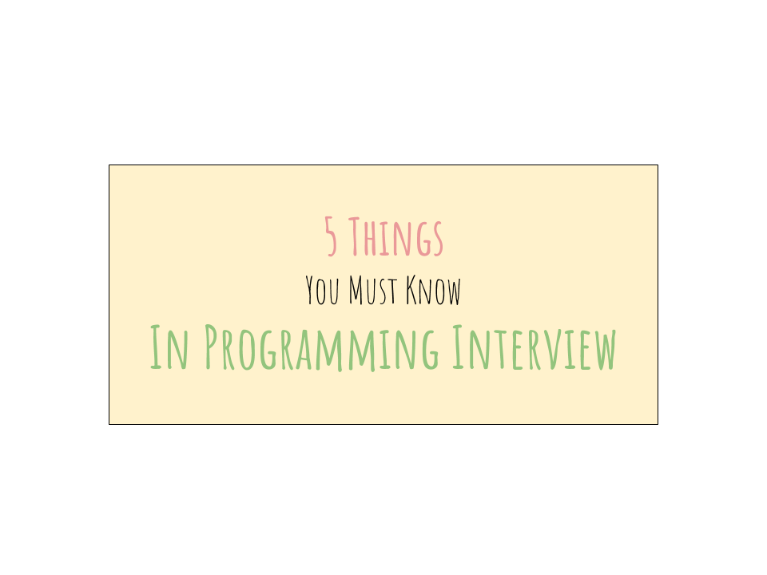

This article is intended for those who are trying to start their programming career, or are preparing to interview for their dream job. As someone who’s been on [both sides of the interviewing table](https://medium.freecodecamp.org/how-i-landed-offers-from-microsoft-amazon-and-twitter-without-an-ivy-league-degree-d62cfe286eb8), I understand how it feels to be the the interviewee.

This **non-exhaustive list** of questions floated through my mind all the time.

- “Am I supposed to talk through my code?”
- “How often should I communicate with the interviewer?”
- “Oh god, I forgot to instantiate my variable! Am I doomed?!”
- “What does the interviewer think of my answer?”
- “Is it OK if I do this?”

… And the list goes on…

It is a very scary experience. It is very difficult. And it is extremely hard to operate within this vacuum when you’re being scrutinized for every single thing you say and every thing you write.

You’re interviewing for your dream job, something you’ve dreamed of since you were 12. And it all comes down to impressing someone you’ve never met within 60 minutes.

The struggle is real.

# 1\. Always think ahead

Often, you’ll hear an interviewer ask this: “OK, I think that looks good. Now, how would you improve this code?”

**This is a killer question**. And this is because it isn’t just a filler to pass time. The interviewer is trying to assess how you think about:

- code quality
- some concerns/bottlenecks that weren’t raised in the algorithm planning session
- how you would scale the solution at hand.

Just because you solved the problem doesn’t mean you’ll automatically get an offer.

For example, when you look at this piece of code below, what does it do? How would you improve it? What might cause it to break?

Let me know in the comments below. I’d love to hear your thoughts.

Python code to do X

**Surprise🤭**: Being able to come up with a working solution is the **bare minimum to be considered for the position.** These questions are basic competency tests. What separates the good candidates from great is the ability to think beyond what’s required.

## What this means in a coding session

Think about edge cases, scaling issues, problem areas. Always think one step ahead. If you’re using a recursive approach, what would happen if you have a large data set? If you’re using a hashing algorithm, how do you handle collisions? How likely is that to happen, and what’s the worst case scenario?

# 2\. There’s more than one answer

There is always more than one way to solve a programming interview problem. **Always**. There are usually multiple ways of tackling a problem, some of which might not be optimal.

One of my favorite [tech Youtubers](https://www.youtube.com/watch?v=IWvbPIYQPFM) taught me that a coding interview is a mental exercise to see how a candidate thinks. From an interviewer perspective, I’m not looking to check if you know what the right answer is. Yes, it is important that you can write **a working solution**, but it’s not the only thing.

More than that, I’m looking for how smart this person is, how the solution is derived, and what other creative solutions this person might be thinking about.

A programming exercise to illustrate my point:

[Merge two sorted linked lists](https://leetcode.com/problems/merge-two-sorted-lists/?tab=Description). (It’s linked to Leetcode if you’d like to try solving). Basically you can tackle this in several ways:

1.  Put all the nodes into an array and then sort it. Then, create a pointer and link every element in the array together.
2.  Merge them using pointer manipulation. Compare the two, keeping track of which is smaller, and then return the results at the end.

If you’d like to learn more about how to tackle programming questions, I teach a small class that focuses on acing the tech interview. You can find out more about it [here](http://www.bit.ly/interviewcourses), or on my website: [zhiachong.com](https://zhiachong.com/courses/)

# 3\. OOP is not dead

Object-oriented programming is not dead. It’s a love-hate relationship for some people, yet it’s a valuable skill to have. This is one of the fundamental skills — a programming technique every programmer should know.

Many candidates jump head-first into a programming problem without putting further thought into simplifying the code. I used to be in this bunch and, admittedly, I still do it sometimes.

**However, the ability to turn complex problems into simpler, manageable chunks by object-oriented programming is a rare and treasured skill.**

Writing code for computers to understand is easy. Writing code for humans is hard.

# 4\. Craft your **résumé**

Imagine you’re heading to prom night with the person of your dreams, and you show up at their doorstep in flip flops and a sleeveless t-shirt.

Credits to Futurama and Imgflip.com

Your résumé is your business card. It’s the company’s first impression of you.

If you’re starting out on your job search, then the very first thing you should do is [prepare a great résumé](https://medium.freecodecamp.org/how-to-write-a-great-resume-for-software-engineers-75d514dd8322). That’s the **number one thing that is often overlooked** by job seekers and, arguably, is the lowest hanging fruit.

I see a lot of candidates who spent weeks, if not months, preparing for coding interviews. But the time they spent on crafting their résumé pales in comparison.

# 5\. Communicate early and communicate often

When I first started interviewing, I was erring on the side of **over-communicating**_._ This meant I was trying to talk through every single line of code I was writing, even if it was a simple for-loop.

I’m not the type who is able to talk and think at the same time. Some people are gifted in the way that they’re able to think out loud, but I can’t.

**Communicate as often as you need**. I tried to communicate early and often. Whenever there was an issue, I would raise it with the interviewer and let them know. It helped me determine if I was heading in the right direction, and course-correct if I was not.

A programming interview is looking for both hard **and** soft skills. Lacking one or the other means a definite no. For further information, I wrote a more detailed article about how to improve a software engineer’s soft skills [here](https://medium.freecodecamp.org/how-to-be-a-successful-software-engineer-6f82a5b1a82e).

Don’t pressure yourself into talking through every single line of code. If you’re using some esoteric features of a programming language, you can explain it once you’re done writing the whole thing.

## **What this means in a coding session**

If you have already established some way of solving the problem, then you can just politely let the interviewer know that you’ll be diving deep into writing the code. Don’t feel that you need to explain every single line of code.

# 6\. \[Extra\] Use abstraction

Here’s another extra tip I picked up that helped tremendously when I was interviewing: **use abstraction for complex methods.**

Using abstraction to hide the complicated implementation details doesn’t mean that you’re shoving the dirty details under the rug. It means that you understand less is more. Remember, you are writing code for humans to understand. Showing good judgement here will definitely earn you extra brownie points with the interviewer.

## What this means in a coding session

Let’s compare and contrast these two pieces of code:

Traverse a matrix

In my opinion, I think the right side looks much cleaner, and much easier to understand. I can then take the time to implement `getNeighbors`, or `isEmpty`, depending on what is requested of me.

The important thing here is that abstraction has now helped keep my code clean, easy to read, and easy to understand. Who doesn’t like to have their cake and eat it too?

# Why do I want to share my experience?

I’ve somehow miraculously managed to overcome the obstacles and find my way to my dream job. This is by no means my way of bragging. It is not my intention at all.

I truly want to help others like me who are struggling to land their dream job. I’ve been through it. I understand the hardship, the sweat and tears of preparing for a programming interview. I believe that the world isn’t a zero-sum game — the more people who do better in life, the better our society becomes, and the more prosperous we’ll all be as a result of that. It’s a win-win situation.

Hopefully these tips are able to help another job seeker out there! Good luck! 👍

If you enjoyed this article, here are a few more recommended articles I wrote:

- [How I landed offers from Microsoft, Amazon and Twitter without an Ivy-league degree](https://medium.freecodecamp.org/how-i-landed-offers-from-microsoft-amazon-and-twitter-without-an-ivy-league-degree-d62cfe286eb8)
- [How to write a great resume for software engineers](https://medium.freecodecamp.org/how-to-write-a-great-resume-for-software-engineers-75d514dd8322)
- [How I automated my job search by building a web crawler](https://medium.freecodecamp.org/how-i-built-a-web-crawler-to-automate-my-job-search-f825fb5af718)
- [How to System Design](https://medium.freecodecamp.org/how-to-system-design-dda63ed27e26)

# Resources and tools I recommend

- [Elements of Programming Interviews](http://amzn.to/2Dcs6Qd): Great for more difficult coding problems
- [Cracking The Coding Interview](http://amzn.to/2Hj91OH): Great for covering foundational CS
- [OneNote](http://onenote.com): I use this to store all code snippets
- [Evernote](http://evernote.com): For everything else
- [CodeRunner](https://coderunnerapp.com/): I love this Mac app! I used this multiple times to run ad-hoc Python scripts/functions and it just works amazingly well. 🔥
- [DailyCodingProblem](http://dailycodingproblem.com/zhiachong): It’s a service that sends out daily coding problems to your email. Use my coupon code, zhiachong, to get \$10 off!
- [CodePath](https://codepath.com/): A non-profit org that helps people prepare for a career in tech. Nathan and Tim are great people and I have learned a lot from them. The community is very helpful and everyone is willing to give a hand.
- [Fine-point markers](http://amzn.to/2oTWeeS): Bring these to your interview. I highly recommend them!

_Zhia Chong is a software engineer at Twitter. He works on the Ads Measurement team in Seattle, measuring ads impact and ROI for advertisers._

_You can find him on_ [_Twitter_](https://twitter.com/zhiachong) _and_ [_LinkedIn_](https://www.linkedin.com/in/zhiachong/)_._
