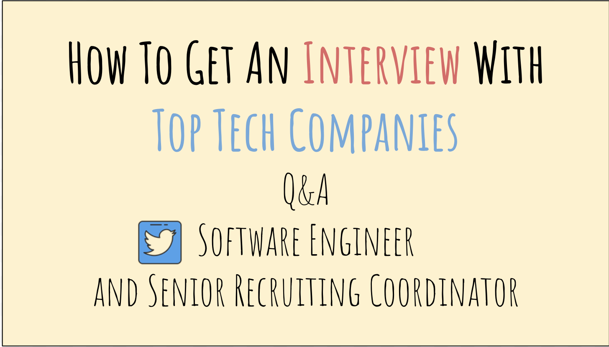

If you’ve ever wondered how to land an interview with top tech companies or know someone who’s been struggling to get an interview with one, then this article is for you.

This is a compilation of some **extremely** **useful** tips from a conversation between a software engineer and a senior technical recruiting coordinator.

A few weeks ago, I had a conversation with a friend, [Bernadette Lagman](https://www.linkedin.com/in/bernadette-lagman-aa527997), who is currently a senior technical recruiting coordinator for [Qualtrics](https://www.qualtrics.com/), an experience management platform. Prior to Qualtrics, Bernadette was at Amazon. She’s also a [TedX speaker](https://www.youtube.com/watch?v=i2mVAHCyoCA)! I highly recommend watching her talk on the Art of Hardship to know her thoughts on how to overcome adversity.

10/19/2018: Read more about my [courses here](http://bit.ly/interviewcourses) to learn how I prepared.  
8/25/2018: Read here for my [experience](https://medium.freecodecamp.org/what-ive-learned-in-1-year-at-twitter-65150f5d4af2) after a year at Twitter.

# What this is about

Here is the list of questions that Bernadette and I tackled from my perspective as a software engineer, and from her perspective as a recruiting manager.

- How to network?
- How to work with your recruiter?
- What does a great résumé look like?
- How to land an interview?

# How To Network

## Software Engineer says

**Networking should happen somewhere that’s closest to you.** If you’re a student/fresh grad, then a great place to go is your school alumni network.

Many schools have an active alumni network that is kept up-to-date. It’s a great opportunity to get to know people who’ve been in your shoes, who can relate to your college experience and know the rigor of your curriculum, and can vouch for your ability.

I highly recommend reaching out to the alumni either through LinkedIn or email. There are many resources like [this](https://hbr.org/2016/09/a-guide-to-cold-emailing) that talk at length about how to write a great introduction email, so I won’t get into that today.

Take note that you should not barge in and start demanding that they spend their time on you. You want to keep the interaction professional and respectful.

My suggestion is **to be proactive**, and offer to buy them a cup of coffee or lunch in exchange for their time. Sincerity goes a long way.

Here’s something to give you an idea of what to say, and what not to say, in a first introductory email:

> Hi \_, my name is Zhia and I found your contact information on LinkedIn. Thanks for your time in reading this email.
>
> I noticed that we both graduated from the same university, and we also graduated from the same Computer Science program with Dr. X. She grilled me very hard on my CS fundamentals, but it was one of the best programs I’ve ever had!
>
> I’m currently in Seattle, and I’m actively looking for an internship. Can I buy you a coffee or lunch sometime near your work place? I’d love to pick your brain on how to find a job in the tech industry.

Simple, respectful, and to the point.

**For industry hires,** [**Meet-ups**](http://www.meetup.com/) **are a great place to go to network**. Finding an area of interest to start is a great idea. If you’re interested in mobile development or data analytics, then you should make time to go to meet-ups nearby so that you can meet more like-minded individuals. More often than not, these people are also working in the area you’re interested in, and you can build an organic connection that way.

## Recruiting team says

Bernadette loves the idea of networking through alumni as well. She adds that networking shouldn’t be a strenuous stretch that requires you to dress to the nines at cocktail parties to strike up awkward or unwanted conversations with executives for that next big move.

> Even the most unconventional places from your doctor’s office to your local coffee shop can provide opportunities to learn if you are open to them. The key is to keep networking natural and open - don’t ask others for jobs but instead ask how they reached their point of success.

She says that recruiters are humans too, and should be approached with a sense of humility. The recruiting team wants to help you succeed, and it should be a two-way discussion with a lot of humility and respect for each other.

People are always open to helping others if you are open and genuine about it. Even if the job interview doesn’t work out, keep an open mind, be respectful, and the next time an opportunity opens up, who do you think the recruiter will call? The candidate who treated them with respect and showed genuine interest in working together, or the jerk who slammed the phone shut after the recruiter told them the team decided they weren’t a good fit?

# How to work with your recruiter

## Software Engineer says

A recruiter **should be your partner or resource** in a job interview. Finding a job is a bi-directional discussion between you as a candidate and the company. The recruiter _acts as a bridge_ between these two parties, coordinating and orchestrating communication and making sure things go smoothly.

As a software engineer, you should ask questions like

- what is the interviewing process
- how to best prepare for my interview
- what should I expect during the process
- what does the timeline look like, etc.

These are all valid questions to ask.

A recruiter should be a resource, much like StackOverflow is a resource for engineers. Ask the recruiter questions that will help you make informed decisions, or have a better expectation of the process.

The career levels of software engineers differs across companies, and you can find them on certain websites like [levels.fyi](http://levels.fyi/). But the most accurate leveling information will come from the recruiter, and that’s one way you can use your recruiter to figure out the title, compensation band, or job requirement for the interview.

## Recruiting team says

Bernadette acknowledges the frustration candidates feel when recruiters don’t communicate with them effectively. Often, a recruiter is doing multiple things at the same time - recruiting, scheduling and coordinating between multiple candidates and multiple teams at the same time.

She recommends that even if a job interview doesn’t pan out, you should stay on friendly terms with the recruiter, and send follow-up emails to ask for your recruiter’s opinion on how you can improve, which areas of your resume didn’t resonate with the team etc. Again, be genuine and respectful in your interaction.

A recruiter will provide help on salary, level, and compensation information. She says that most recruiters refrain from asking current compensation information due to legal reasons. When a recruiter asks for your desired compensation, you **should be as transparent as possible** because your recruiter will be representing you in front of the hiring team.

She notes that **compensation information is very transparent in the industry.** Recruiters know what is the average compensation for a SDE-2 at Amazon or Microsoft or any other well-known tech company. Thus, you should use your recruiter as a resource for figuring out what the expected compensation should/can be and work towards bridging the gap between what you expect and what the hiring team is willing to commit to.

# What does a great resume look like?

I wrote an [article](https://medium.freecodecamp.org/how-to-write-a-great-resume-for-software-engineers-75d514dd8322) on how to write a great resume for software engineers. So I won’t be spending a lot of time on that. 😆

## Software Engineer says

In general, there are three ways of doing it:

- Online application
- Coding challenges
- Referral

In the tech industry, there’s an unspoken rule that online applications have the _lowest chance of success_. There are some exceptions to the rule, but that’s the exception. You’re being pitted against hundreds of other online applications, and the chances that you’ll get picked are extremely low.

There are some online coding challenges, which give you the opportunity to interview if you solve them. In my view, these are 50–50 because some companies don’t actually reach out after you solve them. This has happened to a lot of people, and generally I don’t recommend this approach unless you really have no other way of getting in.

For college hires, there’s another great opportunity to get noticed: job fairs. Most universities will organize an on-campus job fair where different companies set up booths to attract new graduates. I’ve seen a lot of companies, like Google and Facebook, conduct white-board interview sessions on-site. Sometimes, you’ll even get an offer the same day if you do really well.

On rare occasions, some companies also offer interview blitz where there’s a room full of candidates and you’re put through different interviewing loops in one day. These are great, because you get to talk to different teams on the same day, and if you do well, you can expect to get an offer pretty much the same day too.

**My best recommendation is to ask for referrals**. Referrals are the best in terms of getting in front of a hiring manager. And you’ll get fast-tracked through the process, because you’re not competing against hundreds of other faceless applications anymore. You’re a _highly coveted referral_ from someone who already works there and can vouch for your abilities.

If you want to know how to get a referral, then refer to the above section on How To Network.

## Recruiting team says

All of the above we touched on will help you land an interview. Bernadette adds that when you’re applying online, you’re competing universally with everyone else like new grads and industry hires.

However, if you know someone from the company or a referral, you’ll likely leap bounds ahead because internal references are trusted sources within a company. She notes that there are some companies that much prefer referrals over online applications.

When a recruiter goes through hundreds of resumes in a day, everyone looks the same on paper. She adds that it’s important to get face-to-face time with recruiters or hiring managers either through meet-ups or LinkedIn. A recruiter is much more likely to recommend you for the position if they can put a face to a name and they know exactly who you are and what your skills sets are.

# Resources and Tools I Recommend

- [How I landed offers from Microsoft, Amazon and Twitter without an Ivy-league degree](https://medium.freecodecamp.org/how-i-landed-offers-from-microsoft-amazon-and-twitter-without-an-ivy-league-degree-d62cfe286eb8) - I share my journey, learnings and resources that helped me land a job at Twitter.
- [How to write a great resume for software engineers](https://medium.freecodecamp.org/how-to-write-a-great-resume-for-software-engineers-75d514dd8322) - A collaboration piece between myself and a senior technical recruiter from Twitter.
- [A guide to cold emailing](https://hbr.org/2016/09/a-guide-to-cold-emailing) - A Harvard Business Review article that talks about how to write an appealing cold-email.
- [Meetup](http://www.meetup.com/) - Platform for finding activities around you. I’ve used it to find software engineering related meet-ups around me.
- [Cracking The Coding Interview](http://amzn.to/2Hj91OH): Great for covering foundational CS
- [Evernote](http://evernote.com): I use this for storing everything I write. From code snippets, to contacts information, Evernote has everything I need.
- [Refdash](https://refdash.com/?source=AMAfbR): Best free mock interviewing platform. The quality of mock interviews here is 🔥. The interviewers are ex-Googlers. I highly recommend trying them out.

# Credits

Thanks to [Open source portfolio](https://medium.com/u/e68c5c9127bb?source=post_page-----c27f18e9d157--------------------------------) for proof-reading and providing invaluable suggestions on how to improve this article. They are a contributor on [effai](https://medium.com/effai-me), a publication that writes about intentional living, mindfulness, and financial independence.
