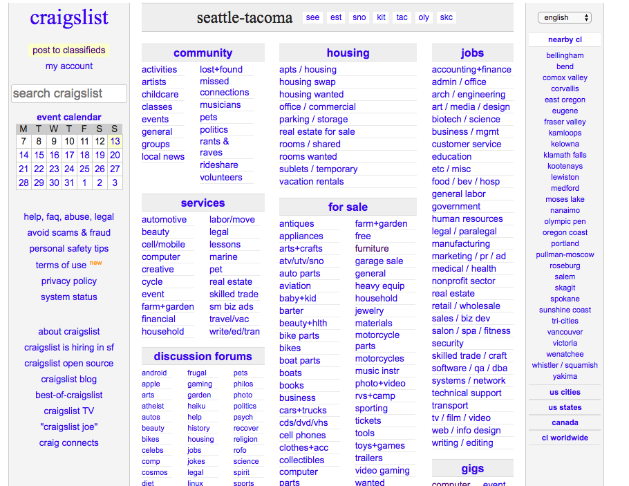
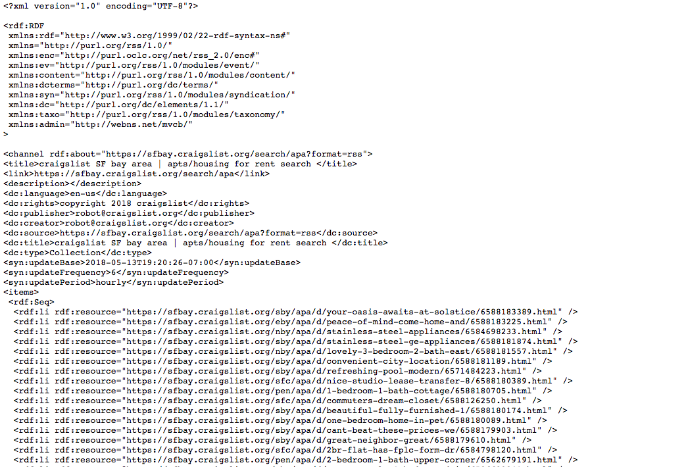
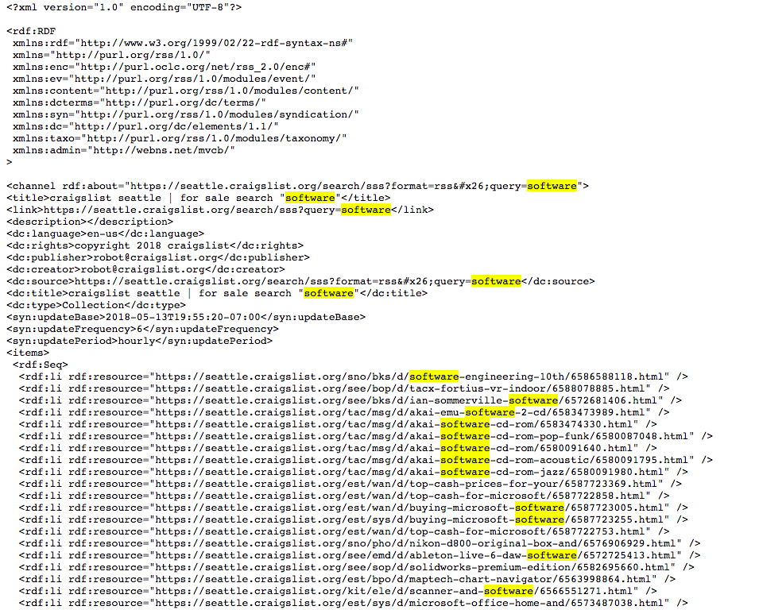
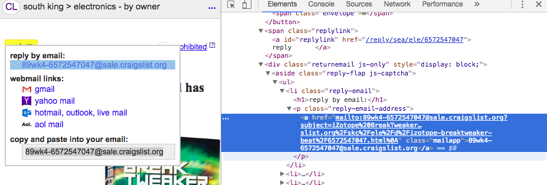
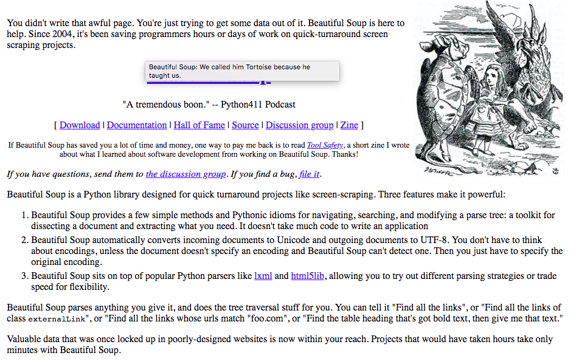
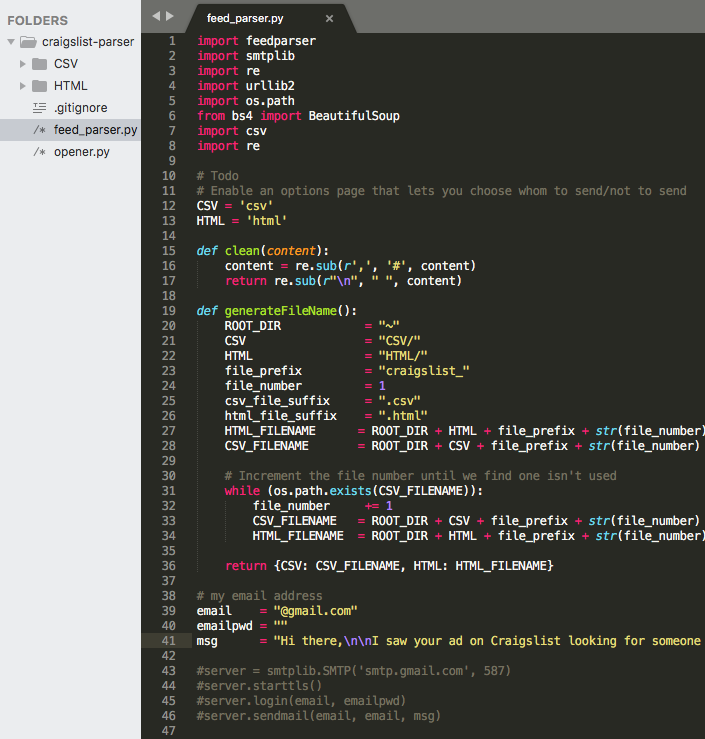

It was midnight on a Friday, my friends were out having a good time, and yet I was nailed to my computer screen typing away.

Oddly, I didn’t feel left out.

I was working on something that I thought was genuinely interesting and awesome.

I was right out of college, and I needed a job. When I left for Seattle, I had a backpack full of college textbooks and some clothes. I could fit everything I owned in the trunk of my 2002 Honda Civic.

I didn’t like to socialize much back then, so I decided to tackle this job-finding problem the best way I knew how. I tried to build an app to do it for me, and this article is about how I did it. 😃

## Getting started with Craigslist to find jobs

I was in my room, furiously building some software that would help me collect, and respond to, people who were looking for software engineers on [Craigslist](https://seattle.craigslist.org/). Craigslist is essentially the marketplace of the Internet, where you can go and find things for sale, services, community posts, and so on.

At that point in time, I had never built a fully fledged application. Most of the things I worked on in college were academic projects that involved building and parsing binary trees, computer graphics, and simple language processing models.

I was quite the _“newb”_.

That said, I had always heard about this new “hot” programming language called Python. I didn’t know much Python, but I wanted to get my hands dirty and learn more about it.

So I put two and two together, and decided to build a small application using this new programming language.

## The journey to build a (working) prototype that applies for jobs

I had a used, somewhat functional [BenQ](https://www.engadget.com/2007/11/19/benq-intros-the-joybook-r43-laptop/) laptop my brother had given me when I left for college that I used for development.

It wasn’t the best development environment by any measure. I was using Python 2.4 and an older version of [Sublime text](https://www.sublimetext.com/2), yet the process of writing an application from scratch was truly an exhilarating experience.

I didn’t know what I needed to do yet. I was trying various things out to see what stuck, and my first approach was to find out how I could access Craigslist data easily.

I looked up Craigslist to find out if they had a publicly available REST API. To my dismay, they didn’t.

However, I found the _next best thing._

Craigslist had an [RSS feed](https://www.craigslist.org/about/rss) that was publicly available for personal use. An RSS feed is essentially a **computer-readable summary** of updates that a website sends out. In this case, the RSS feed would allow me to pick up new job listings whenever they were posted. This was **perfect** for my needs.

Next, I needed a way to read these RSS feeds. I didn’t want to go through the RSS feeds manually myself, because that would be a time-sink and that would be no different than browsing Craigslist.

Around this time, I started to realize the power of Google. There’s a running joke that software engineers spend most of their time Googling for answers. I think there’s definitely some truth to that.

After a little bit of Googling, I found this useful post on [StackOverflow](https://stackoverflow.com/questions/10353021/is-there-a-developers-api-for-craigslist-org) that described how to search through a Craiglist RSS feed. It was sort of a filtering functionality that Craigslist provided for free. All I had to do was pass in a specific query parameter with the keyword I was interested in.

Admittedly, I was completely new to this whole web-scraping idea at the time. If you’d like to learn how to build side projects or how to land a job as a software engineer, you can check out a small class that I teach [here](http://bit.ly/interviewcourses).

I was focused on searching for software-related jobs in Seattle. With that, I typed up this specific URL to look for listings in Seattle that contained the keyword “software”.

> [https://seattle.craigslist.org/search/sss?format=rss&amp;query=software](https://seattle.craigslist.org/search/sss?format=rss&query=software)

And voilà! It worked **beautifully**.

### The most beautiful soup I’ve ever tasted

I wasn’t convinced, however, that my approach would work.

First, the **number of listings was limited**. My data didn’t contain **all** the available job postings in Seattle. The returned results were merely a subset of the whole. I was looking to cast as wide a net as possible, so I needed to know all the available job listings.

Second, I realized that the RSS feed **didn’t include any contact information**. That was a bummer. I could find the listings, but I couldn’t contact the posters unless I manually filtered through these listings.

I’m a person of many skills and interests, but doing repetitive manual work isn’t one of them. I could’ve hired someone to do it for me, but I was barely scraping by with 1-dollar ramen cup noodles. I couldn’t splurge on this side project.

That was a dead-end. But it wasn’t **the** end.

### Continuous Iteration to build an automated job search bot

From my first failed attempt, I learned that Craigslist had an RSS feed that I could filter on, and each posting had a link to the actual posting itself.

Well, if I could access the actual posting, then maybe I could scrape the email address off of it? 🧐 That meant I needed to find a way to grab email addresses from the original postings.

Once again, I pulled up my trusted Google, and searched for “ways to parse a website.”

With a little Googling, I found a cool little Python tool called [Beautiful Soup](https://www.crummy.com/software/BeautifulSoup/). It’s essentially a nifty tool that allows you to parse an entire [DOM Tree](https://www.w3schools.com/js/js_htmldom.asp) and helps you make sense of how a web page is structured.

My needs were simple: I needed a tool that was easy to use and would let me collect data from a webpage. BeautifulSoup checked off both boxes, and rather than spending more time picking out **the best tool**, I picked a tool that worked and moved on. Here’s a [list of alternatives ](https://www.quora.com/What-are-some-good-Python-libraries-for-parsing-HTML-other-than-Beautiful-Soup)that do something similar.

Side note: I found this awesome [tutorial](https://medium.freecodecamp.org/how-to-scrape-websites-with-python-and-beautifulsoup-5946935d93fe) that talks about how to scrape websites using Python and BeautifulSoup. If you’re interested in learning how to scrape, then I recommend reading it.

With this new tool, my workflow was all set.

I was now ready to tackle the next task: scraping email addresses from the actual postings.

Now, here’s the cool thing about open-source technologies. They’re free and work great! It’s like getting free ice-cream on a hot summer day, **and** a freshly baked chocolate-chip cookie to go.

BeautifulSoup lets you search for specific HTML tags, or markers, on a web page. And Craigslist has structured their listings in such a way that it was a breeze to find email addresses. The tag was something along the lines of “email-reply-link,” which basically points out that an email link is available.

From then on, everything was easy. I relied on the built-in functionality BeautifulSoup provided, and with just some simple manipulation, I was able to pick out email addresses from Craigslist posts quite easily.

### Putting things together

Within an hour or so, I had my first MVP. I had built a web scraper that could collect email addresses and respond to people looking for software engineers within a 100-mile radius of Seattle.

I added various add-ons on top of the original script to make life much easier. For example, I saved the results into a CSV and HTML page so that I could parse them quickly.

Of course, there were many other notable features lacking, such as:

- the ability to log the email addresses I sent
- fatigue rules to prevent over-sending emails to people I’d already reached out to
- special cases, such as some emails requiring a Captcha before they’re displayed to deter automated bots (which I was)
- Craigslist didn’t allow scrapers on their platform, so I would get banned if I ran the script too often. (I tried to switch between various VPNs to try to “trick” Craigslist, but that didn’t work), and
- I still couldn’t retrieve **all** postings on Craigslist

The last one was a kicker. But I figured if a posting had been sitting for a while, then maybe the person who posted it was not even looking anymore. It was a trade-off I was OK with.

The whole experience felt like a game of [Tetris](https://en.wikipedia.org/wiki/Tetris) - I knew what my end goal was, and my real challenge was fitting the right pieces together to achieve that specific end goal.

Each piece of the puzzle brought me on a different journey. It was challenging, but enjoyable nonetheless and I learned something new each step of the way.

## Lessons learned

It was an eye-opening experience, and I ended up learning a little bit more about how the Internet (and Craigslist) works, how various different tools can work together to solve a problem, plus I got a cool little story I can share with friends.

In a way, that’s a lot like how technologies work these days. You find a big, hairy problem that you need to solve, and you don’t see any immediate, obvious solution to it. You break down the big hairy problem into multiple different manageable chunks, and then you solve them one chunk at a time.

Looking back, my problem was this: **how can I use this awesome directory on the Internet to reach people with specific interests quickly**? There were no known products or solutions available to me at the time, so I broke it down into multiple pieces:

1. Find all listings on the platform
2. Collect contact information about each listing
3. Send an email to them if the contact information exists

That’s all there was to it. **Technology merely acted as a means to the end**. If I could’ve use an Excel spreadsheet to do it for me, I would’ve opted for that instead. However, I’m no Excel guru, and so I went with the approach that made most sense to me at the time.

### Areas of Improvement

There were many areas in which I could improve:

- I picked a language I wasn’t very familiar with to start, and there was a learning curve in the beginning. It wasn’t too awful, because Python is very easy to pick up. I highly recommend that any beginning software enthusiast use that as a first language.
- **Relying too heavily on open-source technologies. Open source software has it’s own set of problems,** too. There were multiple libraries I used that were no longer in active development, so I ran into issues early on. I could not import a library, or the library would fail for seemingly innocuous reasons.
- **Tackling a project by yourself can be fun, but can also cause a lot of stress**. You’d need a lot of momentum to ship something. This project was quick and easy, but it did take me a few weekends to add in the improvements. As the project went on, I started to lose motivation and momentum. After I found a job, I completely ditched the project.

## Resources and Tools I used

[The Hitchhiker’s Guide to Python](https://amzn.to/2J73RtJ) — Great book for learning Python in general. I recommend Python as a beginner’s first programming language, and I talk about how I used it to land offers from multiple top-tier top companies in my article [here](https://medium.freecodecamp.org/how-i-landed-offers-from-microsoft-amazon-and-twitter-without-an-ivy-league-degree-d62cfe286eb8).

[DailyCodingProblem](http://dailycodingproblem.com/zhiachong): It’s a service that sends out daily coding problems to your email, and has some of the most recent programming problems from top-tier tech companies. Use my coupon code, zhiachong, to get \$10 off!

[BeautifulSoup](https://www.crummy.com/software/BeautifulSoup/) — The nifty utility tool I used to build my web crawler

[Web Scraping with Python](https://amzn.to/2sa43xR) — A useful guide to learning how web scraping with Python works.

[Lean Startup](https://amzn.to/2GLnRN6) – I learned about rapid prototyping and creating an MVP to test an idea from this book. I think the ideas in here are applicable across many different fields and also helped drive me to complete the project.

[Evernote](http://evernote.com) — I used Evernote to compile my thoughts together for this post. Highly recommend it — I use this for basically \_everything\_ I do.

[My laptop](https://amzn.to/2s9sziy)– This is my current at-home laptop, set up as a work station. It’s much, _much easier_ to work with than an old BenQ laptop, but both would work for just general programming work.

**Credits:**

[Brandon O’brien](https://twitter.com/hakczar), my mentor and good friend, for proof-reading and providing valuable feedback on how to improve this article.

[Leon Tager](https://twitter.com/OSPortfolio), my coworker and friend who proofreads and showers me with much-needed financial wisdom.

You can sign up for industry news, random tidbits and be the first to know when I publish new articles by [subscribing here](/subscribe/?src=automate-my-job-search)(no spams, promised).

_This article was originally posted on [Medium](https://medium.com/@zhiachong/how-i-built-a-web-crawler-to-automate-my-job-search-f825fb5af718)._
