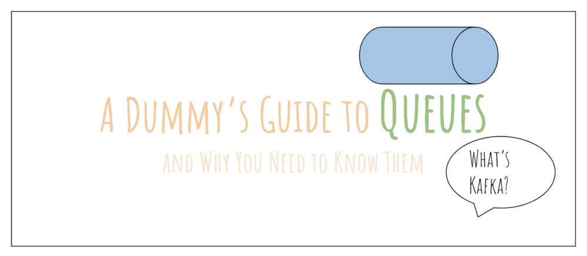
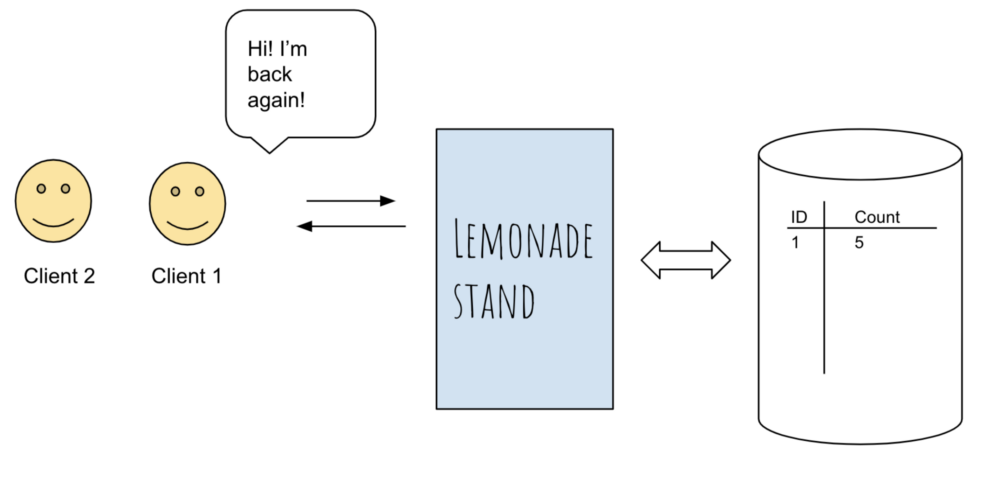
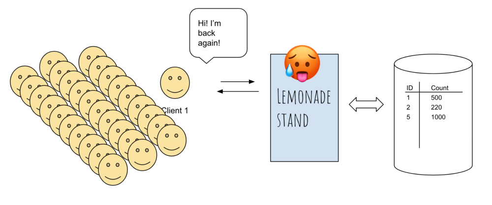
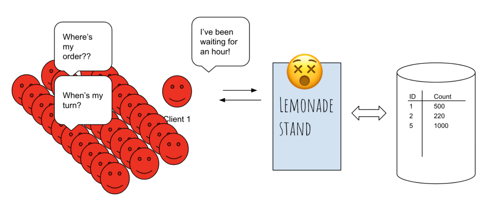
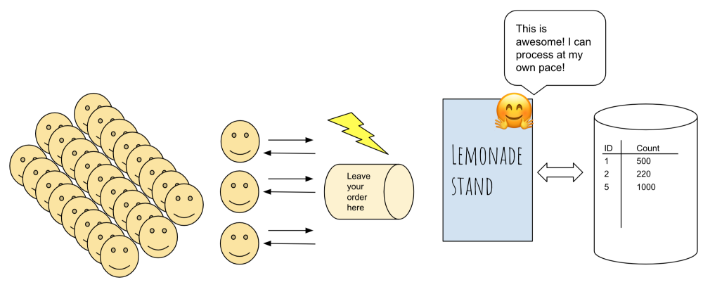

If you’ve ever wondered what _Kafka, Heron, real-time streaming, SQS or RabbitMQ_ are all about, then this article is for you. I’ll discuss in detail why we need a queue for today’s modern software architecture, what are some common technologies used, and how queues are commonly used in the industry. If you enjoy this article, I have [a course](https://docs.google.com/document/d/1PeK69h4H82rwKjhactiE_sAIorCcZgXgXTY7k-nXpnE/edit#heading=h.hs0b333nsxch) on scaling distributed systems where I discuss these topics in more detail.

OK, let’s get into it!

---

# Why do you need a queue/message broker?

Imagine that you are running a lemonade 🍋 stand, and you built out a nifty little web-app that **keeps track of how often your clients return to your lemonade stand.**

Your web-app has an endpoint, say `yourlemonade.com/traffic` and every time you click on a button, the traffic count goes up by 1. _Beautiful._

As the traffic to your lemonade stand increases, you click the button more and more. Well, since you’re living in a relatively small neighborhood, you only get 10–20 people per day. Your sales proceed as usual, the web-app handles the traffic just fine, and everything is fine and dandy. Perfect.

## The nightmare of a booming business

Now that your lemonade stand has made a name for itself, people from across the city are flocking in to get a taste of your famous lemonade. And on a beautiful Sunday morning, the local news decided to promote your stand, and the traffic **_EXPLODES_**_._

As you can imagine, the traffic to your lemonade stand increases from 10–20 people per day to 10,000 per day. You’re tapping the traffic button furiously, which in turns triggers a call to _yourlemonade.com/traffic,_ and your web app keeps incrementing the amount of traffic.

Unfortunately, your web-app is hosted on an 8-bit, 128MB RAM server in your house garage. With the booming business and increased traffic, your web-app cannot handle the scale of traffic any longer.

Eventually, your server dies. ☠️

With that, your entire web app is brought down. You can’t keep track of traffic anymore. People are rushing in, orders are piling up, yet your web-app is down and you can’t handle any transactions until you can start logging the traffic again.

**What do you do?**

# Queue to the rescue

A moment of brilliance strikes you, _what if I place a box in front of the counter where each client can just drop a note saying they were there?_

Every time a client walks through the door and places an order, you ask them politely to drop their order sheets in a small box placed in front of the payment counter. Outstanding! You have essentially introduced a mechanism to keep track of arrivals while still allowing your business to function as usual.

This is what we call [_asynchronous processing_](https://stackoverflow.com/questions/748175/asynchronous-vs-synchronous-execution-what-does-it-really-mean), and, _welcome to the world of queues_. 👋

When you start out building software, much like the lemonade stand I mentioned above, it is common for a task to

1.  call a service, then
2.  wait for the service to finish, and then
3.  move on to the next task.

This is what’s called _synchronous processing. Asynchronous processing_, on the other hand, allows a task to call a service, and _move on to the next task_ while the service processes the request at its own pace. That’s why a queue is a beautiful, elegant way to unblock your systems because it puts a layer in front of your services and allows them to tackle the tasks at their own pace.

# If a queue is so powerful, why don’t we just put it in front of everything?

As anyone who has dabbled in distributed systems can attest to, scaling a distributed system is extremely tricky and complicated. There are a few things to know about queues that might make a queue an unattractive proposition for your system.

Some questions I’d ask before deciding if a queue is the right solution for you:

- Is your service having issues due to high traffic? If it’s not, maybe you should look into what the bottleneck is before jumping into queues. As Donald Knuth famously said, [premature optimization is the root of all evil.](https://en.wikiquote.org/wiki/Donald_Knuth)
- Do you have in-house expertise in managing a queue? Or do you need to potentially hire a team to do it for you? Maintenance costs, like scaling the queue, can skyrocket if you’re not careful. There are services like [Amazon SQS](https://aws.amazon.com/sqs/) (Simple Queueing Service) which offer a _managed_ solution (i.e. you don’t need to maintain anything on your own).
- Is it possible to have duplicate entries in the queue? If so, is that acceptable?
- Do you need to keep a record of all transactions, in case a queue goes down?
- In the case that a queue goes down, does the queue need to be able to replay all the entries? What are your backup options?

There are many more concerns that might be specific to your use case, but hopefully, I’ve made my point that adding a queue isn’t as easy as snapping your fingers.

# How Queues Are Used in Modern Architecture

Queues are ubiquitous in today’s modern distributed systems architecture — adopted across various industries for different use cases, and there are more novel use cases every day.

Here are some of the real-world use cases for queues:

## Real-time streaming

When MapReduce came around, it was a huge phenomenon in the industry because it allowed mere mortals to process petabytes of data in a reasonable amount of time, anywhere from days to hours. This might seem absurd today when data’s available in almost seconds, but pre-MapReduce, it wasn’t easy to extract usable data from extremely large data sets.

The appetite for data analytics has grown, and we’re now looking at processing data within hours, and sometimes, _milliseconds_.

To achieve low-latency analytics and performance in a continuous fashion, the concept of real-time streaming was conceived.

A useful example here is to think of ads: ads on Twitter, for example, are shown to millions of people per day. Yet in order to make sure users don’t see the same ads multiple times within a set period of time, Twitter needs to somehow know the last time a user was exposed to a certain ad.

If we had relied on MapReduce to perform this action, it would not even be considered a solution because it’ll take upwards of hours to process all that data. Instead, real-time streaming allows us to process ad impressions as they arrive. This is all made possible because of queues **that allow data to be continuously streamed and processed in real time.**

Some technologies you’ll often hear about in real-time streaming use cases are Kafka, Kafka streams, Redis, Spark Streaming (which is different from Spark) and so on.

## Event-driven architecture

Queues are used as a critical component of an [event-driven architecture](https://en.wikipedia.org/wiki/Event-driven_architecture), or colloquially known as **Pub**(lisher)-**Sub**(scriber). Event-driven architecture is, according to Wikipedia:

> Event-driven architecture (EDA), is a software architecture pattern promoting the production, detection, consumption of, and reaction to events.

I’d like to think of this as subscribing to a newsletter: as a producer of a newsletter, you know who’s subscribed to your newsletter and who’s not. You write the content, and then you send it to your subscribers.

On the other hand, as a subscriber, you might be subscribed to multiple newsletters, but you don’t know who the other subscribers are. But you don’t really care about that. This is a really nice feature because you can now write software that listens to a bunch of events and only responds to the ones you’re interested in.

RabbitMQ and Amazon SQS (Simple Queuing Service) are some of the technologies often used for these types of use cases.

## Distributed, fault-tolerant, scalable infrastructure

Distributed systems are prone to errors, and a queue is one of several ways to increase resiliency in the architecture. In a microservice architecture (or [service-oriented architecture](https://en.wikipedia.org/wiki/Service-oriented_architecture)), multiple microservices communicate with each other through queues as shared interfaces.

When a microservice fails unexpectedly, a queue is still able to accept messages. This essentially _provides a buffer_ for our microservice to recover. Once the microservice comes back online, it can pick up the messages from the queue and process them again.

Think of it as your mailbox. While you’re out on vacation in Hawaii, the mailperson will still deliver your mail into the mailbox. Once you return from vacation, you can pick up the mail and process them at your leisure.

Thank you for reading! I hope you’ve learned a thing or two about distributed queues from my article. If you enjoyed reading this, please leave a clap, and feel free to join my newsletter. _No spams, I promise._

---

# Resources I Recommend

To further your understanding of queues and various topics mentioned above, I would highly recommend these resources below. Or [**join my course**](https://docs.google.com/document/d/1PeK69h4H82rwKjhactiE_sAIorCcZgXgXTY7k-nXpnE/edit#heading=h.hs0b333nsxch) on scaling distributed systems to learn more about queues :)

- [Designing Data-Intensive Applications](https://amzn.to/2I80wup): Awesome book for learning about scaling distributed systems! Highly recommended.
- [Kafka the Guide](https://amzn.to/2D8FUxS): I used this book as a reference guide, and enjoyed it for the high-level description.
- [Kafka Streams](https://www.confluent.io/blog/introducing-kafka-streams-stream-processing-made-simple/): This is an informative article from Confluent that talks in some high-level detail about Kafka’s implementation of stream processing.
- [Elements of Programming Interviews](http://amzn.to/2Dcs6Qd): Great for solving coding problems.
- [Cracking The Coding Interview](http://amzn.to/2Hj91OH): Great for covering foundational CS coding problems.
- [Daily Coding Problem.com](https://www.dailycodingproblem.com/zhiachong): This is a free-to-try website that offers free daily coding problems. You can sign up for interesting daily coding challenges, and you can pay for solutions if you’d like. If you use my referral link ([dailycodingproblem.com/zhiachong](http://www.dailycodingproblem.com/zhiachong)), you get \$10 off!
