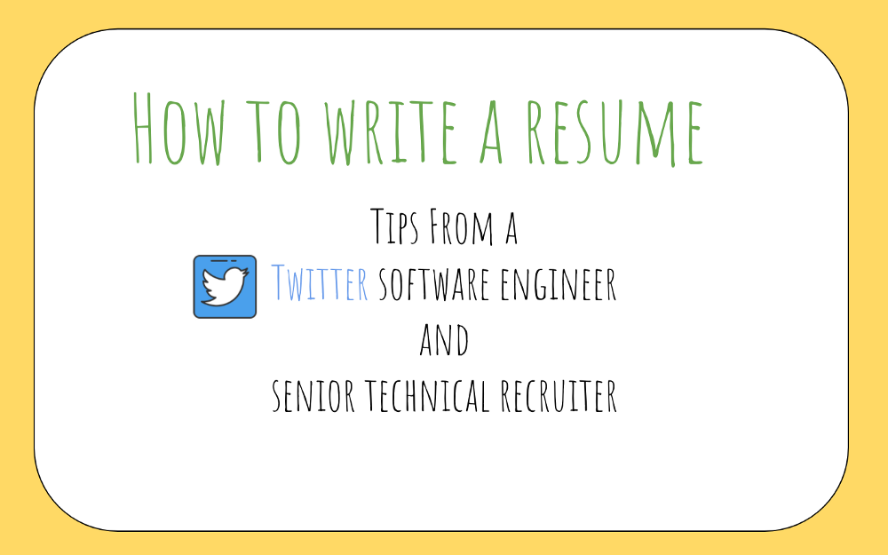

For those of you who are starting out on your job search, and have questions about how to prepare a great résumé that can get your foot in the door, then this article is for you.

I recently wrote an [article](https://medium.freecodecamp.org/how-i-landed-offers-from-microsoft-amazon-and-twitter-without-an-ivy-league-degree-d62cfe286eb8) about how I prepared for my job interviews and finally landed my dream job at Twitter. And many people reached out to learn more, and a majority of them wanted to know how to write a great résumé.

---

This article is a collection of advice and tips I compiled together with [Kristin Simmons](https://www.linkedin.com/in/kristinsny/), a senior technical recruiter at Twitter. I worked with her during my recruiting process, and she’s been an absolute blast to work with.

What this article is about:

- Do’s in a résumé
- Don’ts in a résumé
- Extra tips
- Advice for new graduates
- Tools/resources I recommend

**10/19/2018**: Read more about my [courses](http://bit.ly/interviewcourses) here to learn how I prepared.  
**8/25/2018**: Read [here](https://medium.freecodecamp.org/what-ive-learned-in-1-year-at-twitter-65150f5d4af2) for my experience and learnings after a year at Twitter.

### What this is about

I recall distinctly the day I had to write my résumé, and I absolutely blanked out. I had no idea where to start.I wasn’t sure if hobbies should be included, or if my experience as a retail assistant was relevant. In other words, **I was lost when it came to writing a résumé.**

As it turns out, résumé writing is both an art and a science, and it can be very daunting to write one.

To be clear, I’m not an experienced recruiter — I have no idea what a recruiter looks for when screening résumés.

I wanted to share my thoughts on how I learned to prepare my own résumé, and I then sought out help from Kristin who could help me fill in areas where I couldn’t.

The following is a condensed form of our collective wisdom.

### Do’s in a résumé

**A résumé should be** **short, concise, and easy to read\*\***.\*\*

That means:

- **Be consistent.**Use consistent font (Arial/Times New Roman are OK) and no more than three **font sizes** for readability
- **Use sections**(use four major ones: Work Experience, Education, Skills, Projects)
- **Use keywords in your résumé, and be accurate.** Recruiters do look for keywords in résumés (e.g. _Java, Python, Hadoop, real-time_ are some examples of keywords)**.**
- **Social media accounts are OK to list, if it’s relevant.** [GitHub](https://github.com/) is popular for hosting software, so that’s OK to list. Snapchat, not so much.
- **Explain why you are suitable for the position.** You can write a cover letter as an add-on, or a brief summary at the top of your résumé. These give recruiters a stronger signal of who are you and why you want to apply.
- **Use numbers.** If you helped a website scale, don’t just write it verbatim — put a **metric** in there. “I helped the website scale from 10K views/day to 100K views/day.”
- **Use an active voice.** Use verbs like “designed,” “implemented,” “executed,” “drove,”and “planned.”
- **Use PDF.** Any other file format, like .docx, might cause your résumé to render differently.
- **Pick two to three projects you know really well.**You should know these from top to bottom, front to back. Knowing two to three projects really well shows dedication and ability to ship things, two desirable traits any company needs.

**Just save it as PDF. It’ll save you a lot of trouble.**

A short résumé goes a long way. The reason for this is that a recruiter, especially at a top-tier company, receives hundreds, if not thousands, of résumés per day. Imagine if they spend 1 minute per day on a résumé, and they go through 300 résumés a day. That’s 300 minutes or **five** **hours of work per day, 25 hours per week.**

Having short, concise résumé ties into the adage that résumés should be kept to a single page. This is a **guideline, and not the rule\***.\* If you’re a college-fresh graduate with not a lot of experience under your belt, then stick to this rule of thumb.

### Don’ts in a résumé

**Do not assume that your résumé is a reverse chronological ledger of everything you’ve done in the past.** In other words, curate your résumé with a very critical eye.

That means:

- **Do not list all the positions you’ve held since high school**. A retail position you held in high school over summer would not be of much interest to a tech company.
- **Do not quantify your skill level.**Put technologies you’ve worked with, and skip out on labeling them as “Good,” “Expert,” and so on.
- **Do not list every single buzzword you’ve heard of**. Some examples include “big-data,” “real-time,” “machine learning,” “docker,” and “batch streaming.” Use them with care. You’ll probably be asked to demonstrate your knowledge of these technologies during the interview.
- **Do not go in-depth without explaining how it’s relevant.** Most candidates have done something cool, but they fail to make recruiters see how it’s relevant.
- **do not list irrelevant skills.** Microsoft Excel, Word, and so on are basic computer skills most people know, so you can leave those out.

---

### Extra Tips

This section will focus on minor things that I personally think are helpful to know. It helped me set the right tone and mindset when I was writing my résumé.

#### Craft a story

A résumé is a story — your story. Imagine you’re taking someone on a story-telling journey, and the story is about yourself.

Recruiters/hiring managers want to know **are you smart in the field you’re in, and do you have potential for growth\*\***.\*\* Anything in your résumé that signals you’re smart should be in there.

**Use a résumé as a canvas to put your best foot forward**. What are some highlights, challenges, obstacles in your professional life, and how do these make you a good candidate? A résumé should attempt to answer these questions.

Likewise, patents, publications, or inventions that are relevant to the position are **great things to have** on a résumé, too.

In most cases, if you can make a case for why a patent is relevant to your application, then feel free to include it in your résumé. Think of it as extra-curricular activities — it shows passion, grit and dedication outside of your regular realm of work.

#### Optimize for readability

I think this is crucial to understand. A résumé is not a regurgitation of what you have done, but rather a **thoughtful and well-curated** list of your journey.

Be highly selective of what you choose to include, and what not to include.Each bullet point should provide a hint, or a signal, to the recruiter of who you are, and why you are a good fit.

A good mental exercise I have is, **if I only have 60 seconds to pitch someone on** **why** **they should hire me**, what would the pitch look like?

I then work backwards from there and expand on the things I’ve done in order to drive home my pitch.

An example would be:

> I’m a backend software engineer who is highly driven and well-versed in RESTful architecture. I built highly scalable web apps that scaled to over millions of users and drove the product vision for my company

The points I want to drive home here are:

- backend engineer
- RESTful architecture
- scalable
- product visionionary

I would then curate my résumé to center around those four pillars. What are some of the things I’ve done in the past that show my passion in product, my skills as a backend engineer, my design experience around RESTful architecture, and what metrics I can show to demonstrate the products are scalable?

---

# Advice for new graduates

For fresh graduates and people who are switching from a non-tech career, this is the section you should pay attention to.

## Your school matters

Does brand matter? **Yes, it does**. The school you go to and the company you interned with are important factors.

Some companies tend to recruit heavily from certain schools — the usual suspects, such as Stanford, MIT, and University of Washington, come to mind here — and if you go to one of these top Computer Science schools, then you have an upper hand over other applicants already.

However, all hope’s not lost even if you don’t attend a prestigious school. A good name brand serves as a signal, yet there are various other signals that are important as well.

## Experience Experience Experience

For one, if you didn’t go to Stanford and you haven’t had much of an experience in a tech company, Kristin suggests providing details around how your current experience translates into a good fit with the tech company you’re applying for.

More often than not, she sees candidates write in detail about how they’ve worked hard in a retail position during summer, and the values they’ve brought about as a result of their work. However, the candidates fail to tell the recruiter anything about their ability to flourish in a tech company.

A tech company is very different from a retail position — I’ll leave this topic for another day. A recruiter, and a hiring manager, wants you to convince them why you’ll fit in and why they should hire you.

A good candidate will write in detail about their retail experience, and **also tie that into something** that is relevant to the position they’re applying for.

In case you’re thinking you don’t have a chance because you’ve never worked with technology, don’t despair. Your experience isn’t the sole determination of whether or not you qualify. **Your hobbies or interests can be useful signals as well.**

If you’ve enjoyed tinkering with electronics, soldered things together, or in essence demonstrated proficiency in dealing with complicated technologies, then, by all means, put them on your résumé.

At the end of the day, the recruiter wants to see how your background is relevant to the position. Everyone is distinctly different from one another, and each person brings a different set of skills to the table.

Show the recruiter what you’re capable of. Use those 60 seconds appropriately, and give them a reason to think, “hey, this person might be a good fit.”

Once you get your foot in the door, use that opportunity to get your dream job. To read more about how to prepare for an interview, I wrote an article about how I prepared for my job interviews and finally landed my dream job at Twitter.

---

# Tools / Resources You Might Enjoy

- [Cracking the Coding Interview](http://amzn.to/2Hj91OH) — a great starter book on coding in general, and some résumé writing tips in there. I used this to prepare my first draft of my résumé.
- [The Google Résumé](http://amzn.to/2DsXTMO) — great starter book, for new grads in particular. Talks about majors/minors to pick, how to write résumés, and sort of a step-by-step guide for getting the dream job.
- [Elements of Programming Interviews](http://amzn.to/2Dcs6Qd): Great for more difficult coding problems
- [OneNote](http://onenote.com/): I use this to store all code snippets
- [Evernote](http://evernote.com/): For everything else
- [CodePath](https://codepath.com/): A non-profit org that helps people prepare for a career in tech. Nathan and Tim are great people and I have learned a lot from them. The community is very helpful and everyone is willing to give a hand.
- [Fine-point markers](http://amzn.to/2oTWeeS): Bring these to your interview. I highly recommend them!
