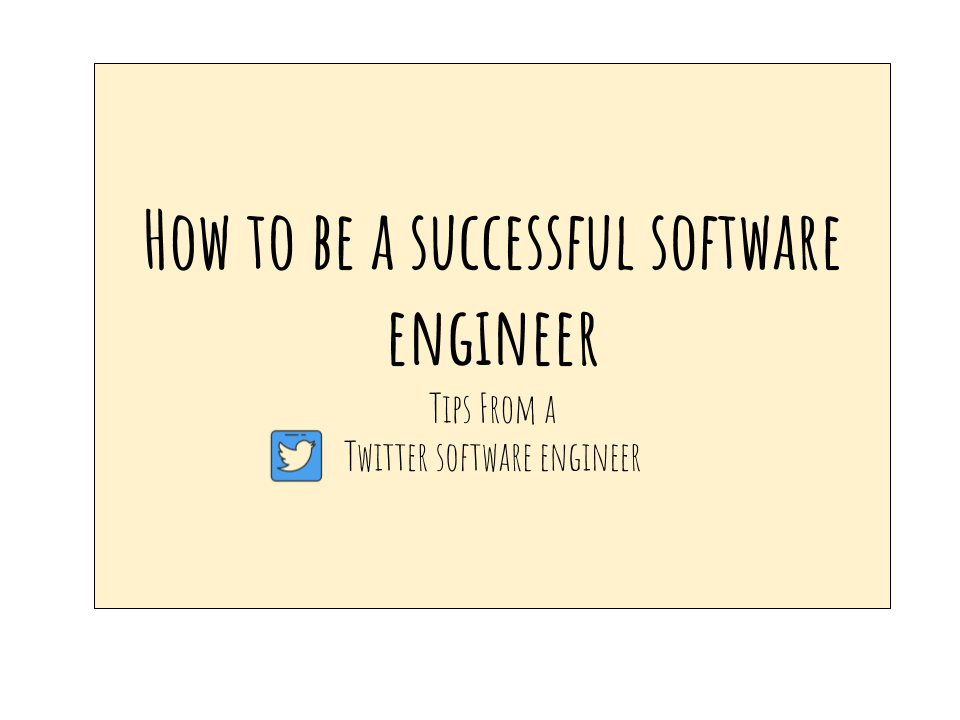

For the young, bright-eyed software engineers who are starting out in their careers, here are some of the best tips I’ve either read or received as a software engineer.

Most of the advice here caters to the software engineering crowd, but I believe there are many tips that are applicable regardless of your profession.

In short, my best advice is:

- [**Underpromise, overdeliver**](#underpromise)
- [**Perfect is the enemy of good**](#perfect)
- [**Stay on a path**](#path)
- [**Collect feedback early**](#feedback)
- [**Seek before you ask**](#seek)
- [**Optimize for simplicity**](#optimize)

If you prefer to watch this in a video format, I’ve made a Youtube video here:

<iframe width="1280" height="720" src="https://www.youtube.com/watch?v=glphNNx0uUc&feature=emb_logo" frameborder="0" allow="accelerometer; autoplay; encrypted-media; gyroscope; picture-in-picture" allowfullscreen></iframe>

# Underpromise, Overdeliver

Underestimating the amount of work needed to accomplish a feature is an _extremely common mistake_ among new, and even experienced, engineers.

If you look at the number of projects that are over-budget and/or delivered late, you’ll be very surprised. It’s a crazy number, something to the tune of 50%.

Let’s consider that for a second: **50% of all projects are either over-budget or delivered late.**

That means out of every 1000 projects, 500, or half of them, are delivered late or over the estimated budget. It just baffles me.

I recall distinctly during my first tech project that I was given the autonomy to lead the feature development. That meant I was the go-to guy who would write up a technical design doc detailing how much time it would take to develop the entire feature, how many engineers we would need, and so forth.

Being the eager, young engineer that I was, I **grossly underestimated** the amount of time needed to get things done. Something to the tune of 2–3x.

I was quite disappointed with myself at the time, and as a result of that, I had a strained relationship with some of my coworkers, too.

My manager then sat me down and gave me some life-changing advice. He said to me, **always underpromise and overdeliver.**

What that means is that you should be conservative with your estimations, provide sufficient buffer for your estimations for various things to go wrong (because [anything that can go wrong, will](https://en.wikiquote.org/wiki/Murphy%27s_law)), and aim to deliver your project ahead of time/under the cost.

## Benefits:

1. Gives you ample time to develop **_and_**refactor as needed*.* Feature development is always a good time to go back and fix some of the [technical debt](https://en.wikipedia.org/wiki/Technical_debt) you (or the team before you) have accumulated over the years.
2. Allows time to figure out the **best** design, and not just a working design.
3. There are many things that can go wrong during feature development. A co-worker goes on vacation, you get sick, meetings, your kid gets sick, your car gets hit, and the list goes on. It’s important to recognize that things can go awry, and you want to ensure you have a buffer in your schedule.
4. Being able to produce high-quality work consistently as a result of #2, and able to deliver on-time every single time as a result of #3, you’re now recognized as **a high-performer within the company** who knows what you’re talking about and can be counted on. Win-win!

You might argue that the downside of under-promising is that others will think you’re being lazy by estimating 10 weeks’ worth of work for something that could be done in 2 weeks.

To be honest, I struggled with this for a while, too. However, I then realized that as long as **you communicate openly and stay consistent with the stakeholders throughout the process**, you’ll be fine.

You’re the person responsible for providing the cost because others rely on your expertise. They know that you’re the one most intimate with the codebase, and they trust you to provide a best-guess. Various things can happen during feature development, and **as long as you’re openly communicating**, everything will be fine.

# Perfect is the enemy of good

As a software engineer, you tend to find that a project lacks this or needs that before it can go out the door. A project could be a coding project or just a technical design doc that you need to write.

What often happens is that as you delve deeper into the project, you start to find that there is more stuff that you haven’t accounted for. You then roll up your sleeves and set your sights on getting to the bottom of things. You decided to spend the next few hours researching and trying to get everything wrapped up.

Ten hours in, nothing actually gets done and you pile up more work than before.

If this sounds familiar to you, then you’re not alone.

This happens to everyone — and it happens to the best of us. I believe that we have been conditioned from a young age to produce work that is **“perfect” or “complete.”** However, in reality, there is no such thing as a perfect solution.

We live in a world of constraints, and there’s a trade-off for every important decision that we make.

The **key here is recognizing we don’t know everything**. You might not realize it, but there is a myriad of alternatives behind most decisions you make.

For example, as a computer science major, what should you do for a first job out of college? Other than working for a startup or a major tech company, you could also work overseas as a freelancer, start a Youtube channel, teach computer science on Udemy, start a blog, or start your own company. The list of options is limitless, and the decision you make today will be based on several key criteria.

You’ll eventually make a decision that is **best for you**, and not necessarily objectively the best, because everyone is unique and there’s no one-size-fits-all.

The best we can do in such a situation is to collect as much information as possible, acknowledge the risks in what we do not know, and make the best decision from there.

The way I think about it is I assign a probability for the worst case scenario, and use that for my decision-making process. This is something I learned from a book called [Principles by Ray Dalio](https://amzn.to/2Id7ZV6), which is a great book that I highly recommend.

## Benefits

If the probability of something going horribly wrong is statistically significant, I either:

1. Look for a better solution or
2. Find ways to mitigate the risks such that they are no longer statistically significant.

Once a decision is made, I then execute on it and move on.

Rinse, and repeat for every problem that I encounter. I find joy in solving these problems, and in some ways, life’s joy is in solving problems of varying magnitude and complexity.

If you’d like to learn more about how to land a job as a software engineer, I teach a small class that focuses on acing the tech interview. You can find out more about it [here](http://bit.ly/interviewcourses).

# Stay on path

Feature creep is one that naturally comes to mind as a counter-example.

You keep wanting to add more features because you feel the current one looks like it was downloaded off of the 90s’ world wide web.

You feel that it’s not ready.

You think that no one would ever want to use your product.

However, note that all these things are going on in **your own head. None of this is validated.** You don’t know what people want until you put something in their hands.

What you should aim for is to set a fixed goal at the beginning of your project, and strive to achieve it no matter what.

## Benefits

The benefits are two-fold:

1. **This reduces feature creep and forces you to focus**. Volumes of books have been written on this, and I won’t bore you with the specific details. Staying laser-focus is crucial, regardless of your position.
2. We humans **love instant gratification.** If you can release something in 2 weeks, then do it! Plan ahead for what your project should be able to achieve in 2 weeks, and then put it in the hands of your users! It’s a very satisfying feeling, and even if it does fail miserably, at least you stuck to your goal and you’ve now collected valuable feedback to iterate on.

This brings me to my next point.

# Collect feedback early

I personally think that we should always aim to release early, release often, and collect feedback as soon as possible.

Of course, I recognize that this is possible primarily for software projects. But hear me out.

Releasing often and releasing early allows you to collect feedback early. Having a healthy feedback loop is a very important, if not _the_ most important, aspect of your project.

You should incorporate a feedback loop early on in your product development so that you know you’re developing the right product for the right people with the right constraints.

It’s equally important to note that **releasing early doesn’t mean releasing a broken product. A broken product is never useful for anyone, and that’s just being disrespectful to your users.**

You should figure out, and deliver, a minimum-viable-product (MVP), which means the bare minimum way your product should perrom in order to satisfy a need.

One thing to note is that **collecting feedback doesn’t mean it needs to be feedback from every single user.**

Consider segmenting your users. Get a small set of users, ideally from various backgrounds (and not just friends and family).

Get your product in their hands so that if you mess up, at least your other users won’t have realized it yet and you will have time to fix it.

# Seek before you ask

A lot of junior engineers tend to ask questions without attempting to find the answers themselves. When they run into something they haven’t encountered before, their first instinct is to ask a senior engineer how it’s done and how to accomplish something.

It will do you a lot of good to seek the answer yourself before asking anyone. The reason is two-fold:

1. Diving deep _allows you to explore areas you might’ve never explored_ before. It gives you an opportunity to gain exposure and be familiar with a different code base.
2. As you move to a more senior position, people rely on you for guidance. You will become the _senior_ in the group over-time. People go to you for help and you’ll need to learn this skill later anyway.

Many developers joke that most of their time is spent on Googling and StackOverflow. I wholeheartedly agree with this, but not for reasons you might think.

The ability to find answers to an ambiguous problem is a highly coveted skill.

> The Internet has developed over time into an easily-accessible treasure trove of information that you can plug into at any time, anywhere, on any device.

Yet, the **ability to ask the right questions** is much more difficult to acquire than the ability to answer them.

As you move along your professional career, you’ll start to realize that figuring out the right questions will be a skill you need to learn, and if you do master it, it will do you wonders.

# Optimize for simplicity

> Strive for simplicity in your work and in your life.

Often times I see junior developers work on a coding project and they’ll use abstraction, inheritance, interfaces, and some very interesting frameworks.

Yet, in spite of all this fanciness, they’re _writing new code that adds more complication than needed_.

People who maintain this code are not going to be the same people who write it, most of the time. Any extra layer of complexity added on will make it much more difficult to onboard new engineers.

As you mature as a software engineer, you realize that writing code isn’t just a matter of optimizing for performance but also optimizing for people. It’s just as important to write code that others can reason about easily.

This is where code readability and code organization come into play.

Unless performance is a real concern, **always opt for the simpler, cleaner approach.**

I believe that simplicity extends to life outside of work as well. **Keep your life free of distractions.** Reduce the number of unnecessary belongings you have in your life. Focus on things that matter to you. Optimize your life for experiences and not for possessions. These are some of the things to keep in mind as you move through life.

---

# Resources I Recommend

- [Principles by Ray Dalio ](https://amzn.to/2GMEI6C)— 🔥 One of the best books I’ve read in a while. The author talks about principles we can apply both in life and at work. I incorporated his framework for solving problems into my daily life
- [DailyCodingProblem](http://dailycodingproblem.com/zhiachong): It’s a service that sends out daily coding problems to your email, and has some of the most recent questions from top-tier tech companies. Use my coupon code, zhiachong, to get \$10 off!
- [How to win friends and influence people](https://amzn.to/2Gmb3xq) — Classic book on building and managing relationships with people 🙌. This book helped me understand how to manage my relationships in the workplace.
- [The Senior Software Engineer](https://amzn.to/2pPZUhq) — 👍 Great book with action items on how to mature as a software engineer. This is where I learned how to Seek before You Ask.
- [Crucial Conversations](https://amzn.to/2GDgxY6) — Great book on how to deal with people in a high-stakes situation. Very applicable across different aspects of life. Whether it’s negotiating for a higher pay 💵 or figuring out communication issues with your spouse 😵, this book has some good tips on solving those problems.
- [Lean Startup](https://amzn.to/2EbBcgt) — Good book on how to use a Minimum-Viable-Product (MVP) to test out an idea before investing further. I’ve used this to test out several startup ideas in the past.
- [Purple Cow](https://amzn.to/2InAGi4) —🐮 Loved this book. Mainly used this to test different startup ideas I have in mind. It talks about how to market your startup and what makes it standout from the rest.
- [Evernote](https://www.evernote.com/referral/Registration.action?sig=3dbd8660e92a8ca68faeb24c552fd32a492c1e620fe4c77e45844685fed05492&uid=18085328) — Best note-keeping app 🔥 I’ve ever used. Highly recommend it!
- [Moleskin notebook](https://amzn.to/2IuEiPw) — I really enjoy this one. The quality of it is extremely high. The price is slightly higher, but since I use it on a daily basis, I consider it a good investment. Holding a beautiful notebook in my hands every day makes me more excited to write more notes.
- [Pilot G2 (Black) ](https://amzn.to/2Gwb9qj)— Easily the best pens I’ve ever used, and only pens I’ll use. I buy them in bulk from Amazon and keep them around everywhere I go. I have one in my backpack, one in office, and one in my home office so that I always have a pen around. It writes great, the ink flows smoothly, and I just love the feel of writing in it. Coupled with the Moleskin, sometimes I just want to pick up the G2 to jot random things on there because these two are so perfect together.

_This post was also cross-posted to [Medium’s The Startup publication](https://medium.com/@zhiachong/how-to-be-a-successful-software-engineer-6f82a5b1a82e), where Zhia is a frequent guest contributor._
