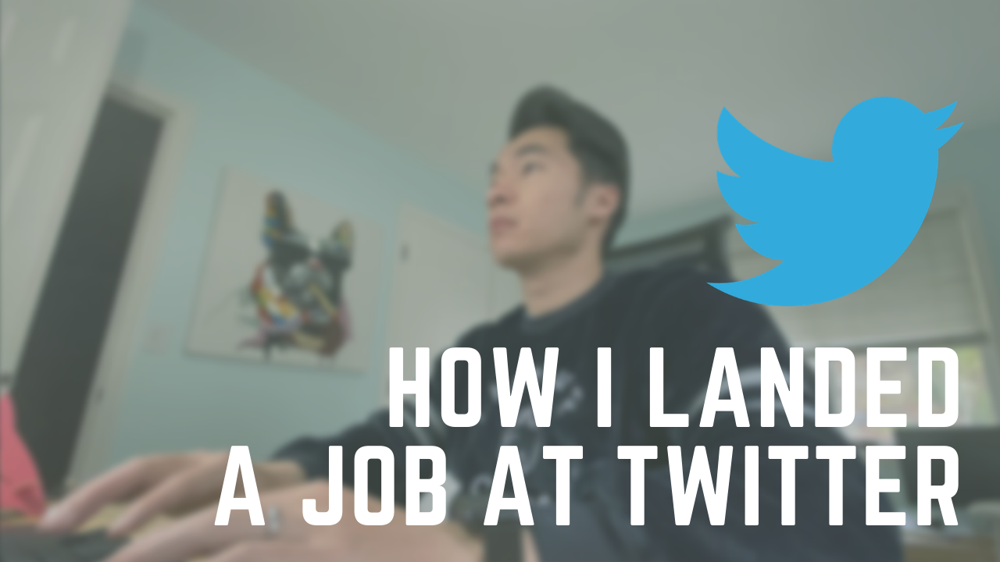

This is the story of how I landed a job at Twitter as a full-time software engineer, what I went through, how I prepared and why I finally decided to join the team.

_Click-clack-click-clack_. The sound of my furiously smashing the keys on my keyboard reverberated through the night.

I looked up from the screen of my laptop and casted my glanced towards a clock on the wall of my basement apartment that I rent for \$600 a month.

It was 2 in the morning.

Now you might think that I’m writing a piece of software for a startup, like a typical hacker.

I wasn’t.

I was preparing for my upcoming technical coding interview using a website called leetcode.com.

Fury took over me because I couldn’t reverse a linked list, which was rated Easy on the platform (try it [here](https://leetcode.com/problems/reverse-linked-list/)).

---

# How I got here

A week ago, a recruiter from Twitter had reached out to me asking if I would like to schedule an initial phone screen with an engineer.

I was excited, but also nervous because I had applied to a software engineering position at Twitter a few years without success.

The recruiter had sent me a prep sheet and where to practice and brush up on my coding and algorithms skills.

One of the items on the checklist pointed me to [leetcode.com](https://leetcode.com/) (a coding challenge website) and that’s how I ended up coating away on this website for hours in order to prepare for my technical coding interview.

It wasn’t easy preparing for technical interviews. For someone who has been out of college for some time, it takes a non-trivial amount of time to brush up on the skills and fundamentals required to succeed in a technical coding interview.

The recruiter explicitly emphasized that our technical interview will focus specifically on technical fundamentals, **like maps, binary trees, linked lists, binary search trees, graphs, and so forth**.

If I were starting out preparing from scratch today, I **would try to seek out a much more structured approach so that I can maximize my preparation time**. This is why I started a [personalized coaching course](https://zhiachong.com/courses/), called _Acing The Technical Interview_, to help people prepare for their interviews as efficiently as possible and ace the technical interview, so that they can avoid the pitfalls and traps I had to learn the hard way. Many other engineers have found success from the approaches outlined in the course.

---

# My Background

## Startup Experience

I had 3 years of experience as a full-stack engineer at a startup, mostly on building micro services and API development on AWS stack. The stack was heavily focused on PHP, NodeJS, AWS SQS as a message queue, Postgres for our database, and AWS S3 for long-term storage.

I had neither prior professional experience nor internship experience and the job at the startup was my first “real” software engineering position.

## College

I had a formal education in computer science — I graduated from a small, private Jesuit college in Washington state in 4 years with a bachelor’s degree in computer science.

Looking back, I think it was a valuable experience to go to college, and if I were to do it again, I would still opt for a formal education over a coding bootcamp. You can watch my video here ([link](https://www.youtube.com/watch?v=FAWTELDDPbg&t=2s)) for a breakdown of a 4-year degree in computer science vs a coding bootcamp.

I applied to over 30 different companies, interviewed with 15, rejected by 6, received offers from 6, declined 5 and accepted 1.

Read [here](https://zhiachong.com/2018/12/19/how-i-landed-offers-from-microsoft-amazon-and-twitter-without-an-ivy-league-degree/) if you’re interested in how I landed offers from top-tier FAANG companies without an Ivy League Degree.

---

# How I Prepared For Interviews

## Elements of Programming Interviews - a real treasure

I spent the majority of my time on leetcode.com and a book called Elements of Programming Interviews. I also around 10% of my time browsing Youtube for systems design interviews, like Jack Gabbard ([link](https://www.youtube.com/watch?v=ZgdS0EUmn70&list=PL73KFetZlkJSZ9vTDSJ1swZhe6CIYkqTL)) and Gauran Sen ([link](https://www.youtube.com/channel/UCRPMAqdtSgd0Ipeef7iFsKw)).

Another I liked was [Daily Coding Problem.com](https://www.dailycodingproblem.com/zhiachong), which sends a question a day to my email with programming questions from top-tier tech companies. Use my coupon code [\_zhiachong](https://www.dailycodingproblem.com/zhiachong) for a discount!

## Time allocation

My preparation time was around a month of _consistent, uninterrupted_ practice. It’s critical to have a consistent schedule. I used to go on coding spurts: 3 hours of hardcore coding and followed by a week of rest. I found that to be ineffective and I paid the heavy price of context switching multiple times.

> In total, I spent **about _3 hours a day on weekdays due to work, and 4 to 6 hours on weekends for a total of about ~20 hours a week_ for a month**.

I applied to Twitter through their job careers page. In hindsight, it might have been more effective to find a referral or recruiter on LinkedIn because that would most likely expedite the application process.

A well-written resume is critical especially applying through an online career center. Without this, I don’t think I would be able to get an opportunity to interview with these top-tier tech companies. Read [here](https://zhiachong.com/2020/03/19/how-to-write-a-great-developer-resume-and-showcase-your-software-engineering-skills/) about how I crafted my resume to get hiring managers to notice me.

A few weeks later, a recruiter finally reached out to me and would like to schedule an initial phone screen.

---

# Timeline

- Feb 10 2017 — Recruiter reached out to schedule a TPS
- March 8 2017 — Initial TPS
- April 13 2017 — Second TPS
- April 18 2017 — Onsite
- May 2 2017 — Offer extended
- July 24th 2017 — official start date (at NHO)

The first 2 technical phone screens involved coding on a shared online document, like Google Docs. We talked about different approaches and trade-offs, and spent 30+ minutes on the implementation.

After the two rounds, I was moved forward to the next round of onsite at Twitter Seattle.

The recruiter then sent me a link to an online coding repository, and asked me to do a code review, make suggestions on how to improve, and discuss it with the interviewers onsite.

I took about a day to go through the code, printed it out on paper (about 5 pages long on 10pt font), and noted areas of improvement on the paper. This proved to be a useful exercise as I would discover later.

---

# Onsite Experience

The onsite had 3 rounds in total:

- Breadth (75 mins)
- Depth (75 mins)
- Lunch
- Top-Grading (90 mins, _Optional_)

One thing to call out is that Twitter’s onsite rounds had 2 interviewers each round. It felt intimidating at first, being stared down by two interviewers who were judging me by my every move. But in reality, I liked it as it felt much more collaborative

---

# My Experience

## Breadth (System Design)

The Breadth interview focuses on a wide range of topics to understand how much you know about designing a system from scratch. The goal is to stretch the candidate to their limits and see how far they can go.

_Are you able to build a reliable system with a reasonable downtime end-to-end, from setting up the UI to communicating via an HTTP API, to a building a backend service?_

These are the types of questions asked. I enjoyed the conversation because I always like to tinker around with different technologies. If you enjoy building things, you’d like this round too. The interviewers were really nice, and politely guided me along during the interview.

We ended with a coding question at the end. I honestly can’t recall what it was, but it wasn’t anything out of the ordinary.

## Depth (Resume)

The Depth interview focused much more on my past projects and expertise. This was, in all honesty, much more intense and challenging because the interviewer dove deep into every single aspect of the projects I built and challenged the design decisions.

Coming from a startup background, I was responsible for building many things from scratch, like setting up AWS clusters, setting up SQS for processing tasks.

No coding questions for this round.

## Cultural

The Cultural (Top Grading) round was a 90-minute interview with the hiring manager and senior leadership. I found out later that if you make it into this round, that means you have done well enough technically and they’re looking for a cultural fit both ways — whether you fit into their culture and would they have the right opportunities for you.

No coding questions for this round.

---

# Retrospective

- Interviews at Twitter **focus heavily on fundamentals of computer science**, so making sure that you know your data structures from top to bottom left to right and also all the basic algorithms that you would have learned in your CS101 class.
- Understanding **how time complexity and space complexity trade-offs work**.
- Knowing and **understanding one language really well** helped tremendously. For this I recommend something like Python or Java or C++ as these are very commonly used languages. I personally enjoy using Python because it is very easy to read, very easy to explain, and it has a bunch of data structures built-in.
- Make sure that to brush up on the projects listed on my resume. This meant **understanding the entire design of the software** I was responsible for end-to-end, **understanding the trade-offs** that were made in the system, and having **reasons for why the systems were built** that way and what were the alternatives.
- **Have discipline in your preparation**. Figure out upfront the areas you’re lacking and set up a schedule to practice. It’s important to get consistent, uninterrupted practice. I started on the wrong foot, and wished that I had known this earlier so that I wouldn’t waste time on the wrong things.
- **Think about systems you interact with day-to-day**. Figure out the trade-offs, alternatives, pros and cons, and how you can build a better system. This skill will carry you very far in software engineering.

---

# Resources

- [Rooftop Slushie](https://www.rooftopslushie.com:443/invite/zhia) — Rooftop Slushie helps you connect with employees at top tech companies like Google and Facebook. Get job interview tips, career advice, insights, and more.
- [Elements of Programming Interviews](http://amzn.to/2Dcs6Qd): Great for solving coding problems.
- [Cracking The Coding Interview](http://amzn.to/2Hj91OH): Great for covering foundational CS coding problems.
- [Acing The Technical Interview](https://zhiachong.com/courses/): Personalized coaching to help you ace the technical interview at top tech companies.
- [Designing Data-Intensive Applications](https://amzn.to/2I80wup): Awesome book to learn about scaling distributed systems! Highly recommended.
- [Daily Coding Problem.com](https://www.dailycodingproblem.com/zhiachong): This is a free-to-try website that offers free daily coding problems. You can sign up for interesting daily coding challenges, and you can pay for solutions if you want.
- [Leetcode.com](https://leetcode.com/): practice coding problems here.

(Check out [my resources page](http://zhiachong.com/resources) for more equipment, tools, books I highly recommend)

_This post is also cross-posted on my Medium page [here](https://medium.com/@zhiachong/how-i-landed-a-job-at-twitter-as-a-software-engineer-c12dc9d85d40)._
