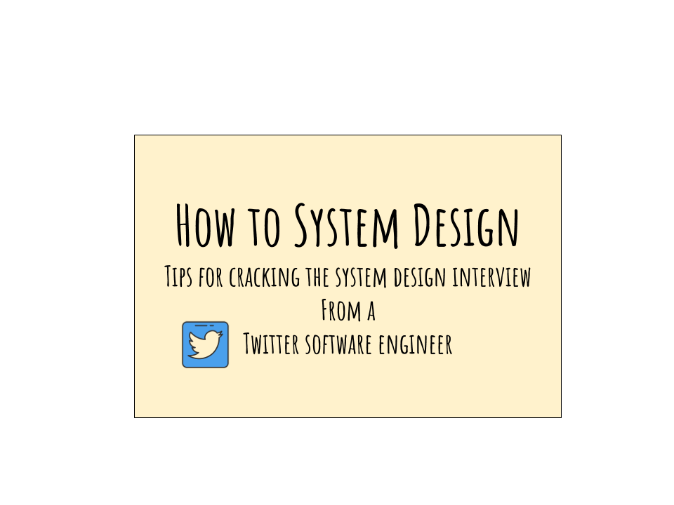
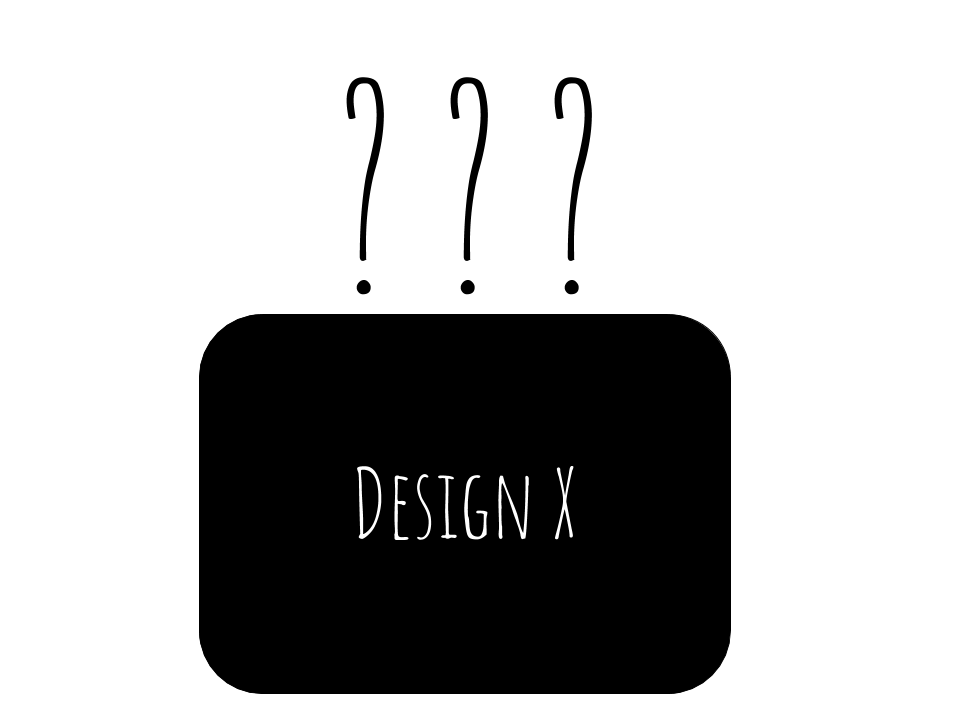
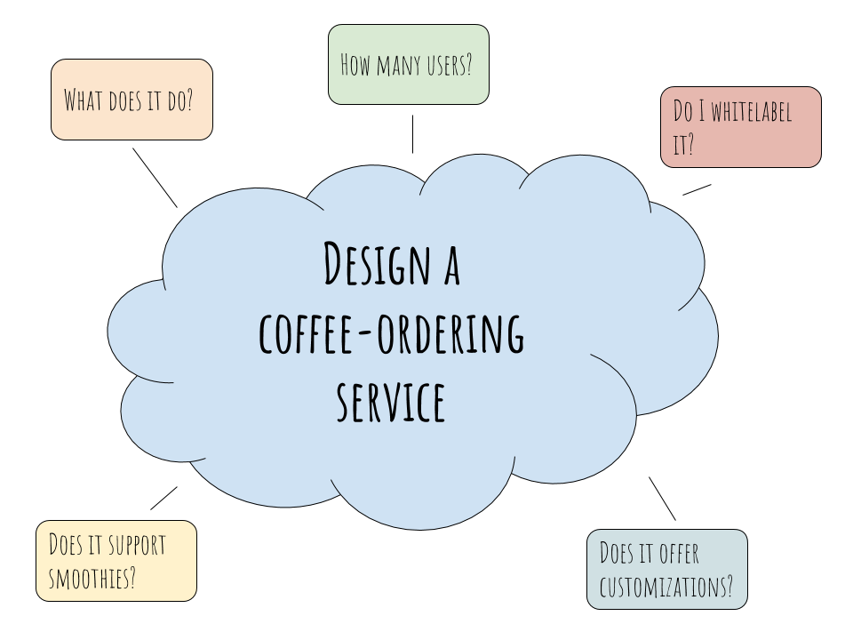
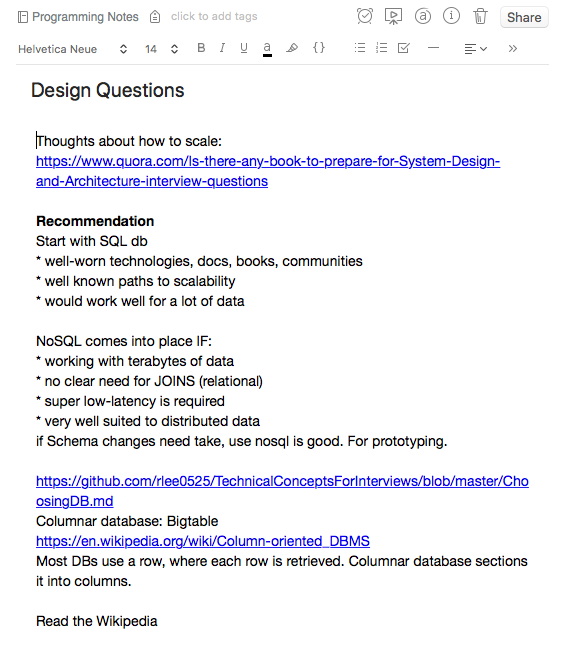

## My Background

I recently wrote about [how I landed offers from multiple top-tier tech companies](/blog/how-i-landed-offers). During my interview preparation process, I read up on a lot of material and prepared a set of notes on how to tackle system design interviews.

In this article, I’d like to share my learnings and tips with you all on how to crack the system design interview.



This article is broken down into the following four sections:

- [**Ask clarification questions**](#clarifying-question)
- [**Use your background**](#use-your-bg)
- [**Tackle a problem systematically**](#systematic)
- [**Keep your own notes**](#keep-notes)

## <a name="clarifying-question"></a>Ask clarification questions

A core aim of a system design interview is to **give the candidate an opportunity to demonstrate their knowledge.**

There are no _strictly right or wrong answers_ in a system design interview.

A great system design question usually sounds ambiguous, and the reason for that is it’s supposed to give you a chance to demonstrate the following:

- How you would think about the problem space
- How you think about bottlenecks
- What you can do to remove these bottlenecks

Let's try to tackle a sample problem:



##Requirements##

Imagine that you’re being asked to design a black box. How would you tackle the problem? There are no clear directions on what you need to build here, aside from the box being able to hold some items within it.

### Strategies for clarifying questions

One of the most useful strategies I personally employ during a system design interview is **to ask clarification questions.** I want to make sure what we are building, what we're not, and any limitations/constraints to be aware of.

What are “good” clarification questions, you ask?

> Clarifying questions help you figure out what you need to build and what you can avoid.

A good clarification question helps you achieve one, or more, of several things:

1. Helps you narrow the scope of what you’re supposed to do
2. Helps clarify what the user expectation of the system is
3. Gives you direction about where to proceed
4. Informs you of possible bottlenecks/problem areas

In the previous black box example, you might ask, “well, what does the box hold? How many items does it hold? And who is the intended user?”

#### Clarified requirements

To that I might say, let’s build a yellow box with a smiley on it that should hold at most 1 tennis ball. This is not an ordinary tennis ball, however. It will be at least 0.5m in radius and weighs about 1kg. It is meant to be hugged, not held, so I don’t want any handle on it.

**System design interview is meant to gauge how you interpret a problem and how you go about solving that problem.**


**Always ask clarification questions**. You are not being judged on whether or not you asked a specific question during the interview, but you are judged on how you think about the problem space.

For example, if I were to ask you to design Twitter right now, how would you do it? Take a few minutes to think about it, and maybe even sketch it out on a piece of paper. Go as deeply and widely as you can, and then come back to this article. Better yet, you can **leave your notes in the comments below** and we can discuss further.

If you haven’t realized it yet, the end result of the exercise above would yield significantly different results.

For my own specific background, I might delve _really deeply into API design and backend infrastructure_. I’d probably explore iPhone-specific problems as well, due to my experience. I’ll talk about how the client interacts with the middle-tier endpoints, how logging would work, how I’d design the backend to ensure uptime, and so on.

These are quite interesting discussions that you can have with a colleague, and that is a very strong signal an interviewer is looking for.

## <a name="use-your-bg"></a>Use your background to your advantage

Often times I see engineers trying to figure out what the interviewer is trying to ask in a system design interview, and then catering their responses to fit the expectations.

I actually **highly discourage** anyone from doing this for several reasons:

1. Everyone has a unique background. In a systems design interview, it’s an opportunity for you to demonstrate what your strengths are. Don’t waste the opporunity trying to figure out what someone else might expect of you.
2. The interviewer might have been nodding along to your answers, but they might’ve known that you’re just bluffing your way through and not actually thinking about the problem.

I enjoy getting my hands dirty and that has given me exposure to a wide range of topics like web crawling, distributed databases, iPhone development and so on. An example: [how I built a web crawler ](/blog/how-to-write-a-great-resume/)to solve my job search problem.

Your experience and background can vary widely from the next candidate in a system design interview. You bring a set of values and expertise to the table that no one else can. **That is what makes you valuable and irreplaceable.** Regardless of what field you’re in, people care about what **you** can bring to the table.

## <a name="systematic"></a>Tackle the problem systematically

Now, with my expertise in mind, there are several things that I think about when I’m tackling a new system. I highly recommend that you formulate a set of criteria or steps for yourself as well.

Some of the things in my mind when I work on a new system are:

- What is the goal of the system?
- Who are the users of the system?
- What is the scale we’re working with?
- Is this a new/old system? How do we handle versioning?

See, my set of criteria will be different from a front-end engineer’s set of criteria. I use these criteria to formulate a picture in my head, and these will guide my decision-making process.

Armed with answers to those questions, I can start to tackle the problem at hand and then systematically break it down into individual components.

### Practice Makes Perfect – practice intentionally

A good exercise I like to do is **how to design a coffee-ordering system** for system design interview practice.

I thought of this while I was sitting at Starbucks one day, and realized that it would be nice if I could order a smoothie on my phone and pick it up at my local Starbucks.



My mind started going in various directions:

- What does this coffee-ordering machine do?
- If I build one, can I sell it to Starbucks, or do I white-label it and sell it as a service?
- How many users do I need to support if I sell it to Starbucks?
- Alternatively, if I white-label it, can I sell the interface to my coffee-ordering service, and then help the customers build out a backend so that they can store the orders on their local machines?

Once I get answers to these questions, I can finally form a full picture of what my coffee-ordering service does. Here’s what **my version** of the coffee-ordering service would look like:

My coffee-ordering service is a software as a service ([SAAS](https://en.wikipedia.org/wiki/Software_as_a_service)). It offers an interface for various partners to plug into.

- It has an API, called _addCoffeeForMerchant_, that inserts coffee name, coffee price, and coffee ingredients.
- It has a GET API, called _getCoffeesForMerchant_, that returns a list of coffees for a given merchant ID.
- The merchant ID is a unique identifier (UUID) that is generated using some hashing mechanism, which can be further clarified with the customer.
- The software is optimized for read-only operations, because most of my customers create their menu once and read it multiple times throughout the day.
- It has a caching mechanism that uses [Least-Recently-Used (LRU) ](https://en.wikipedia.org/wiki/Cache_replacement_policies#Least_recently_used_%28LRU%29)eviction strategy, because if the menu item hasn’t been ordered in a while, my customer doesn’t care if it’s slightly slower in showing up on the menu.
- In case one of the data stores self-erupts, my coffee-ordering service will replicate data across different clusters across US west and US east coast because I am targeting the US market only for now.

```java
public interface CoffeeSystem() {
	public void addCoffeeForMerchant(String coffeeName, Int coffeePrice, Ingredients ingredients) {}

    // Returns a map of coffee name to price
	public Map<String, Int> getCoffeesForMerchant(Long merchantId) {}
}
```

Alternatively, any other coffee-ordering service that you can think of would be highly probable as well. It’s just a matter of what you’re optimizing for. I think these are very interesting problems, and it’s a great mental exercise to keep your mind engaged.

## <a name="keep-notes"></a>Keep your own notes

As a software engineer, it’s a never-ending process of learning. I highly recommend that you use either Evernote or a [Moleskin](https://amzn.to/2IuEiPw) to keep notes for anything programming or system design related tips.

I personally carry a small notebook for quick ideas I need to jot down, and I keep various other things on Evernote whenever I can.

I have a section named `Programming` in my Evernote. Whenever I run into something new, or something interesting, I jot it down within my notebook for further reference.

I go through and assign labels to these new notes on a monthly or quarterly basis to make sure the notes are organized. For example, I have a `Design` label for anything that has to do with system design.

It could be something like a link to a YouTube video that I found interesting, or an interesting argument my coworker put forth that I hadn’t thought about.

This is a sample of what one of my notes looks like:



One of the things I learned recently from a coworker is that NoSQL is great for prototyping, because there’s no need to undergo schema discussions with other teams. If I wanted to change the schema, I can do that really quickly with a NoSQL database. That was a key learning from work that I inserted into my `Programming` notebook.

I break down my notes into:

1. **Systems designs**
2. **Interviewing** (experience + review of different interviews I’ve had in the past, grouped by company name)
3. **Random tid-bits**, CS good-to-know, like useful bash scripts or command-line tricks
4. **Readings / YouTube videos**

All of the notes above go under `Programming`. Over time, I find that I have a pseudo-organized collection of things I’ve either read or explored in the past.

As anyone who knows me on a personal level, I’m not a very organized person. Thus, I’ve only collected maybe 10 – 15% of things, so there’s much more left to do there.

Knowledge and practice go hand-in-hand in getting better at systems designs. If you feel that your current work doesn’t afford you the opportunity to do systems designs, then you should either find one that does, or try to design one small part of an existing architecture such that it’s either faster, cheaper, more robust, or easier to modify in the future.

## Resources I recommend

[Intro to: Architecture and Systems Designs](https://www.youtube.com/watch?v=ZgdS0EUmn70) – Great Youtube tutorial from an ex-Facebook-engineer about how to approach systems design problems.

[Designing data-intensive applications](https://amzn.to/2H1ULel) – Another good resource for learning how to design for scale. It talks about various things a typical software engineer takes for granted — how databases (mySQL and noSQL) work, when to use each, pros and cons of various techniques for handling scale etc. I highly recommend it 👍

Mock Interviews – A simulated environment that mimics the actual interview is extremely helpful in preparing for interviews. If you can find a friend to do it for you, then I highly recommend it. I also run mock interviews for system designs interview, so if you’re interested, feel free to reach me at [zhiachong.com](http://www.zhiachong.com)!

[What every software engineer should know about real-time data’s unifying abstraction](https://engineering.linkedin.com/distributed-systems/log-what-every-software-engineer-should-know-about-real-time-datas-unifying) – A very lengthy and technical discussion about logs, trade-offs. I haven’t finished it yet, but it comes highly recommended from a coworker.

[Evernote](https://www.evernote.com/referral/Registration.action?sig=3dbd8660e92a8ca68faeb24c552fd32a492c1e620fe4c77e45844685fed05492&uid=18085328) – The best 🔥 note-keeping app I’ve used. There are many tutorials on how to best utilize Evernote. I haven’t gone through them yet, simply because I use it as just a notebook. I log everything I learn on there, and then occasionally go through and reorganize them.

[Moleskin notebook](https://amzn.to/2IuEiPw) – I really enjoy this one. The quality of it is extremely high. The price is slightly higher, but since I use it on a daily basis, I consider it a good investment. Holding a beautiful notebook in my hands everyday makes me more excited to write more notes.

[Pilot G2 (Black)](https://amzn.to/2Gwb9qj) – Easily the best pens I’ve ever used, and the only pens I’ll use. I buy them in bulk from Amazon and keep them around everywhere I go. I have one in my backpack, one in the office, and one in my home office so that I always have a pen around. It writes great, the ink flows smoothly, and I just love the feel of writing with it. Coupled with the Moleskin, sometimes I just want to pick up the G2 to jot random things on there because these two are so perfect together.

[Grokking the System Design Interview](https://www.educative.io/collection/5668639101419520/5649050225344512) — This one comes as a recommendation from friends. It’s an online course that teaches how to design distributed system in detail. It’s a \$79 course, however. There’s a team-pricing. If there’s any interest, I’ll check with them to see if it’s possible to form a group for group-discount.

This post was also cross-posted to [Medium](https://medium.com/@zhiachong/how-to-system-design-dda63ed27e26), where Zhia is a frequent contributor.
