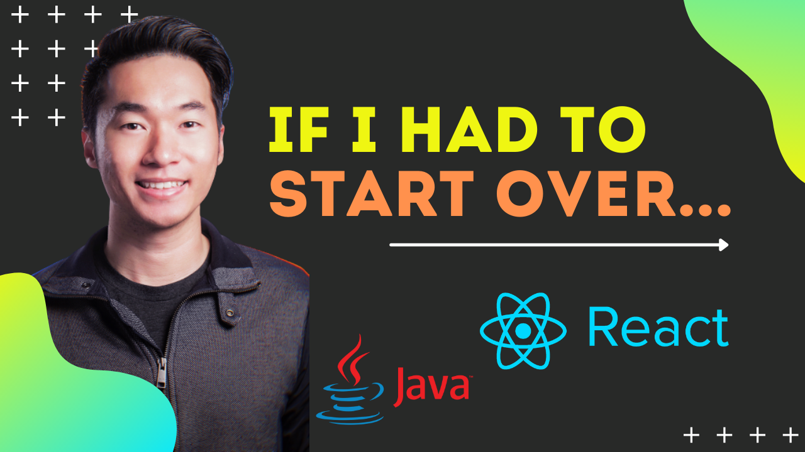

If you were to learn computer science from scratch today in 2021, how should you do it?

This same article in [video form](https://www.youtube.com/watch?v=RLl0tR54YIU&t=5s&ab_channel=ZhiaChong-ProgrammingJourney).

## 1. pick a language.

Pick one that is commonly used and battle-tested.

Great options:

- Java
- C/C++
- Javascript
- Python

I personally recommend Python as it is easy to understand, reads like English with low barrier to entry for beginners.

## 2. get a book.

> An analogy I like to use is you're trying to be a builder - you're going to use your hands and a few tools to build a house.

Learn the syntax, constructs, open/close files, parse strings, among others. Make sure you can manipulate strings, do simple math operations, and perform some I/O operations like writing to a text file.

## 3. build a side project.

Get your hands dirty, build something simple like a diary application or to-do list. Learn simple HTML/CSS, Javascript, SQL.

Know what "full-stack", "DOM", "API", "JSON" means.

[Build a web crawler to apply for jobs](/blog/automating-my-job-search-with-python/), is a good start.

Here's [an article](/blog/cs-terms-you-should-know/) on computer science terms everyone should know that should be helpful to get started.

Pick something easy to implement that will take you a week or so. It doesn't have to be pretty, or even fully functional. The simple act of building and putting it out to the world is enough. Perfect is the enemy of good. Get things done and don't worry about perfection.

## 4. learn data structures and algorithms.

These form the foundations of computer science.

Understand big-oh notation, arrays, hash maps, sets, heaps, common sorting algorithms like QuickSort and MergeSort, finding top K.

I reviewed this [coding book](/blog/best-book-for-coding/) and I think it's the best coding book to practice and learn data structures and algorithm.

## 5. find your tribe.

Find a community, engage with like-minded people who are passionate about programming, learn from them and contribute what you learn.

If you choose to go at it on your own, you're playing the game on hard mode. Don't play it on hard mode. Find a community, engage with like-minded people who are passionate about programming, learn from them and contribute what you learn.
